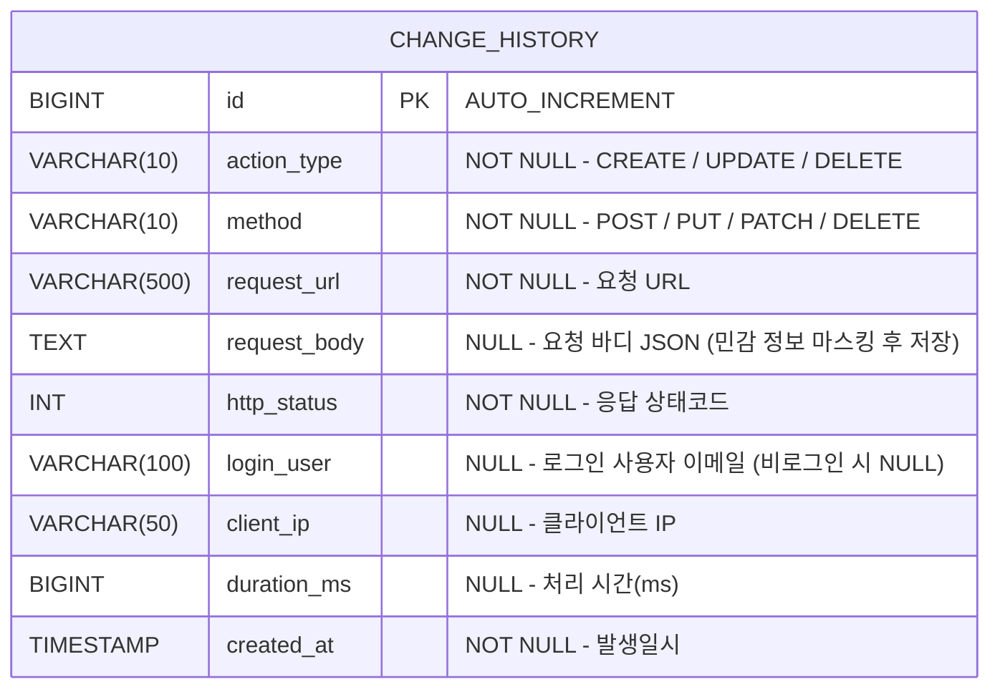

# 변경 이력 DB 설계서

## 1. ERD



---

## 2. 테이블 상세

### 2.1 change_history

> 이력성 테이블 — 수정 없이 저장만 하므로 `updated_by`, `updated_at` 컬럼 제외

| 컬럼 | 타입 | NULL | 기본값 | 설명 |
|:---|:---|:---|:---|:---|
| `id` | BIGINT | NO | AUTO_INCREMENT | PK |
| `action_type` | VARCHAR(10) | NO | - | 변경 유형: `CREATE` / `UPDATE` / `DELETE` |
| `method` | VARCHAR(10) | NO | - | HTTP 메서드: `POST` / `PUT` / `PATCH` / `DELETE` |
| `request_url` | VARCHAR(500) | NO | - | 요청 URL (쿼리스트링 포함) |
| `request_body` | TEXT | YES | NULL | 요청 바디 JSON (민감 정보 마스킹 후 저장) |
| `http_status` | INT | NO | - | 응답 HTTP 상태코드 (200, 201, 400, 500 등) |
| `login_user` | VARCHAR(100) | YES | NULL | 로그인 사용자 이메일 (비로그인 시 NULL) |
| `client_ip` | VARCHAR(50) | YES | NULL | 클라이언트 IP (X-Forwarded-For 우선) |
| `duration_ms` | BIGINT | YES | NULL | 요청 처리 시간(ms) |
| `created_at` | TIMESTAMP | NO | CURRENT_TIMESTAMP | 발생일시 |

---

## 3. action_type 분류 기준

| HTTP 메서드 | action_type | 설명 |
|:---|:---|:---|
| `POST` | `CREATE` | 신규 데이터 생성 |
| `PUT` | `UPDATE` | 전체 수정 |
| `PATCH` | `UPDATE` | 부분 수정 |
| `DELETE` | `DELETE` | 삭제 |

---

## 4. 제외 URL

| URL 패턴 | 제외 이유 |
|:---|:---|
| `POST /api/v1/auth/**` | 로그인·토큰 갱신 — 비밀번호 포함 민감 요청 |

---

## 5. 민감 정보 마스킹 대상

`request_body` 저장 전 아래 필드값을 `****`으로 치환 후 저장

| 필드명 | 예시 |
|:---|:---|
| `password` | `"password":"****"` |
| `passwordHash` | `"passwordHash":"****"` |
| `passwd` | `"passwd":"****"` |
| `pwd` | `"pwd":"****"` |
| `secret` | `"secret":"****"` |
| `credentials` | `"credentials":"****"` |

---

## 6. 인덱스 설계

| 인덱스명 | 컬럼 | 타입 | 설명 |
|:---|:---|:---|:---|
| `PK_CHANGE_HISTORY` | `id` | PRIMARY | PK |
| `IDX_CH_ACTION_TYPE` | `action_type` | INDEX | 변경 유형별 조회용 |
| `IDX_CH_LOGIN_USER` | `login_user` | INDEX | 사용자별 이력 조회용 |
| `IDX_CH_CREATED` | `created_at` | INDEX | 발생일시 범위 조회용 |

---

## 7. 설계 결정 사항

| 항목 | 결정 | 이유 |
|:---|:---|:---|
| `updated_by/at` 제외 | ✅ 제외 | 이력 테이블은 append-only, 수정 없음 |
| 비동기 저장 (`@Async`) | ✅ 적용 | 이력 저장이 메인 API 응답 지연에 영향 없도록 |
| `request_body` TEXT | ✅ TEXT | JSON 크기 제한 없이 전체 저장 |
| 민감 정보 마스킹 | ✅ 저장 전 치환 | 비밀번호 등 평문 저장 방지 |
| `auth/**` 제외 | ✅ 제외 | body 전체가 비밀번호 포함 민감 요청 |
| `login_user` nullable | ✅ | 미인증 요청에서도 이력 저장 가능하도록 |
| `client_ip` X-Forwarded-For 우선 | ✅ | 리버스 프록시 환경에서 실제 IP 수집 |

---

## 8. DDL

```sql
CREATE TABLE change_history (
    id           BIGSERIAL       PRIMARY KEY,
    action_type  VARCHAR(10)     NOT NULL,
    method       VARCHAR(10)     NOT NULL,
    request_url  VARCHAR(500)    NOT NULL,
    request_body TEXT,
    http_status  INT             NOT NULL,
    login_user   VARCHAR(100),
    client_ip    VARCHAR(50),
    duration_ms  BIGINT,
    created_at   TIMESTAMP       NOT NULL DEFAULT CURRENT_TIMESTAMP
);

-- 인덱스
CREATE INDEX IDX_CH_ACTION_TYPE ON change_history (action_type);
CREATE INDEX IDX_CH_LOGIN_USER  ON change_history (login_user);
CREATE INDEX IDX_CH_CREATED     ON change_history (created_at);
```
