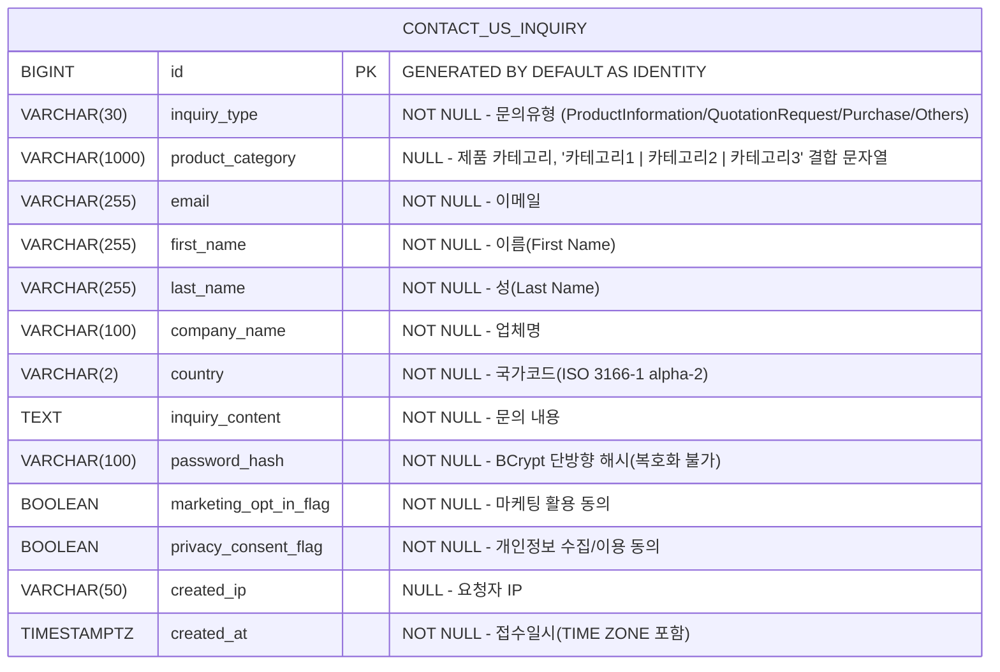

# FO Contact Us(문의 접수 저장) DB 설계서

> FO `/support/contact-us` 문의 폼 제출 내용을 DB에 저장(insert)하기 위한 신규 테이블.
> 기존 CTP(Salesforce) 전송 전용 `ContactUsController/Service`(`/api/v1/public/contact-us`)와는 **완전히 무관한 별도 도메인**이다.
> 이력성(append-only) 테이블 — 저장만 하며 수정/삭제하지 않는다. (`updated_by`, `updated_at` 제외)

---

## 1. ERD



---

## 2. 테이블 상세

### 2.1 contact_us_inquiry

| 컬럼 | 타입 | NULL | 기본값 | 설명 | 폼 필드 매핑 |
|:---|:---|:---|:---|:---|:---|
| `id` | BIGINT | NO | GENERATED BY DEFAULT AS IDENTITY | PK (접수번호 대체 — 별도 caseNumber 생성 안 함) | - |
| `inquiry_type` | VARCHAR(30) | NO | - | 문의유형 코드값 | Inquiry Type (radio) |
| `product_category` | VARCHAR(1000) | YES | NULL | 제품 카테고리 — 선택된 Lv1/Lv2/Lv3 라벨을 `"카테고리1 \| 카테고리2 \| 카테고리3"` 형태로 결합한 문자열 | Product Category (Lv1/Lv2/Lv3) |
| `email` | VARCHAR(255) | NO | - | 문의자 이메일 | Email Address |
| `first_name` | VARCHAR(255) | NO | - | 이름 | First Name |
| `last_name` | VARCHAR(255) | NO | - | 성 | Last Name |
| `company_name` | VARCHAR(100) | NO | - | 업체명 | Company Name |
| `country` | VARCHAR(2) | NO | - | 국가코드 (ISO 3166-1 alpha-2, 예: `us`) | Country |
| `inquiry_content` | TEXT | NO | - | 문의 내용 | Comments |
| `password_hash` | VARCHAR(100) | NO | - | 조회용 비밀번호 BCrypt 해시 (평문/복호화 저장 안 함) | Password |
| `marketing_opt_in_flag` | BOOLEAN | NO | - | 마케팅/뉴스레터 수신 동의 여부 | newsletter 체크박스 |
| `privacy_consent_flag` | BOOLEAN | NO | - | 개인정보 수집·이용 동의 여부 (필수 동의) | personal-info 체크박스 |
| `created_ip` | VARCHAR(50) | YES | NULL | 요청자 IP (감사/스팸 추적용, X-Forwarded-For 우선) | - |
| `created_at` | TIMESTAMPTZ | NO | CURRENT_TIMESTAMP | 접수일시(TIME ZONE 포함) | - |

> **비밀번호 확인(confirmPassword)** 은 저장하지 않는다 — 요청 검증(일치 여부)에만 사용.
> **product_category** 는 선택된 Lv1/Lv2/Lv3 라벨을 FE에서 `"카테고리1 | 카테고리2 | 카테고리3"` 형태로 결합한 문자열 하나를 그대로 저장한다(2026-07-23 확정). 이전엔 devices-tree 행의 rowId를 레벨별 컬럼(`product_category_lv1_id~lv3_id`, BIGINT)에 나눠 저장했으나, 라벨을 하나로 합친 텍스트만 저장하는 방식으로 변경.

---

## 3. 인덱스 설계

| 인덱스명 | 컬럼 | 타입 | 설명 |
|:---|:---|:---|:---|
| `PK_CONTACT_US_INQUIRY` | `id` | PRIMARY | PK |
| `IDX_CONTACT_US_INQUIRY_EMAIL` | `email` | INDEX | 이메일별 조회용 (BO 관리자 조회 단계 대비) |
| `IDX_CONTACT_US_INQUIRY_CREATED` | `created_at` | INDEX | 접수일시 범위 조회용 (BO 관리자 조회 단계 대비) |

---

## 4. 설계 결정 사항

| 항목 | 결정 | 이유 |
|:---|:---|:---|
| 테이블명 `contact_us_inquiry` | 신규(수정) | 기존 CTP 전송 도메인과 물리적으로 분리(기존엔 저장 테이블 자체가 없음). 최초 `fo_contact_us`로 작성했으나 프로젝트 내 다른 테이블(`banner_data`/`download_log`/`error_log` 등) 어디에도 `fo_`/`bo_` 시스템 접두어를 쓰지 않는 컨벤션과 어긋나 수정(사용자 지적) |
| `updated_by/at` 제외 | ✅ 제외 | 문의 접수는 수정 없는 append-only 데이터 (`download_log`/`error_log`와 동일 패턴) |
| 비밀번호 BCrypt 해시 | ✅ | 단방향 저장, 복호화/조회 기능 없음. 기존 `SecurityConfig`의 `PasswordEncoder`(BCrypt rounds=12) Bean 재사용 |
| `password_hash` VARCHAR(100) | ✅ | BCrypt 해시 출력은 60자 고정이나 여유 있게 100 |
| 접수번호(caseNumber) 미생성 | ✅ | PK(`id`)만으로 식별 충분 (요구사항 확정) |
| `product_category` nullable | ✅ | FO 폼상 카테고리는 필수 표시(*) 없음 — 미선택 허용 |
| `product_category` 단일 VARCHAR(1000) 컬럼으로 통합 | ✅ (수정) | 레벨별 rowId(BIGINT) 3컬럼(`lv1_id~lv3_id`) 방식을 폐기하고, 선택된 라벨을 `"카테고리1 \| 카테고리2 \| 카테고리3"`로 결합한 문자열 하나만 저장하도록 변경(2026-07-23) |
| `country` 공통코드 그룹명 `COUNTRYCODE` | ✅ (수정) | 그룹명을 `COUNTRYCODE`로 확정 |
| PK `GENERATED BY DEFAULT AS IDENTITY` | ✅ (수정) | 프로젝트 DB 표준(`docs/db/identity_migration/db_identity_migration.md`) 준수 — 최초 설계 시 `BIGSERIAL`로 작성했던 표준 위반을 수정 |
| `created_at` `TIMESTAMPTZ` | ✅ (수정) | 프로젝트 DB 표준(`docs/db/timestamptz/db_timestamptz.md`) 준수 — 최초 설계 시 `TIMESTAMP`로 작성했던 표준 위반을 수정, Entity는 `OffsetDateTime` 사용 |
| `created_ip` 수집 | ✅ (nullable) | 비로그인 공개 API — 스팸/감사 추적용. 없어도 저장 가능 |

---

## 5. DDL

```sql
CREATE TABLE contact_us_inquiry (
    id                    BIGINT        GENERATED BY DEFAULT AS IDENTITY PRIMARY KEY,
    inquiry_type          VARCHAR(30)   NOT NULL,
    product_category      VARCHAR(1000),
    email                 VARCHAR(255)  NOT NULL,
    first_name            VARCHAR(255)  NOT NULL,
    last_name             VARCHAR(255)  NOT NULL,
    company_name          VARCHAR(100)  NOT NULL,
    country               VARCHAR(2)    NOT NULL,
    inquiry_content       TEXT          NOT NULL,
    password_hash         VARCHAR(100)  NOT NULL,
    marketing_opt_in_flag BOOLEAN       NOT NULL,
    privacy_consent_flag  BOOLEAN       NOT NULL,
    created_ip            VARCHAR(50),
    created_at            TIMESTAMPTZ   NOT NULL DEFAULT CURRENT_TIMESTAMP
);

-- 인덱스 (BO 관리자 조회 단계 대비)
CREATE INDEX IDX_CONTACT_US_INQUIRY_EMAIL   ON contact_us_inquiry (email);
CREATE INDEX IDX_CONTACT_US_INQUIRY_CREATED ON contact_us_inquiry (created_at);

COMMENT ON TABLE  contact_us_inquiry IS 'FO Contact Us 문의 접수 저장(이력성). CTP 전송 도메인과 무관';
COMMENT ON COLUMN contact_us_inquiry.password_hash IS '조회용 비밀번호 BCrypt 단방향 해시(복호화 불가)';
```

---

## 6. inquiry_type / country 공통코드 전환

> `inquiry_type`/`country`는 정규식 하드코딩(@Pattern)/정적 @Size 대신 **공통코드(code_group/code_detail) 기반**으로 관리한다. 저장 시 서비스 레이어에서 `code_detail`의 활성 코드값인지 검증하고, FO 폼은 `GET /api/v1/fo/codes/{groupCode}`로 옵션을 렌더한다.
> 물리 FK는 걸지 않고 **코드값(문자열)만 저장**한다 — BO 관리자가 코드를 추가/비활성해도 과거 접수 데이터 무결성이 유지되도록.

### 6.1 groupCode 및 코드값 네이밍
- **INQUIRY_TYPE**(contact-us 전용): 기존 `code_detail.code`가 UPPER_CASE 토큰(예: `APPROVED`, `URGENT`) 컨벤션이므로 **UPPER_SNAKE_CASE**로 통일. CTP `@Pattern`(PascalCase)/FE kebab-case는 별개 도메인이라 따르지 않는다.
  - `PRODUCT_INFORMATION` / `QUOTATION_REQUEST` / `PURCHASE` / `OTHERS`
- **COUNTRYCODE**(범용, 다른 화면도 재사용): ISO 3166-1 alpha-2 **대문자**(`US`/`CA`/`KR`)로 통일. 기존 FO 폼은 소문자 `us`를 하드코딩했으나, API 전환 후 FE는 API가 내려주는 `code`를 그대로 전송하므로 대문자 캐논으로 고정(대소문자 혼용 검증실패 방지).

### 6.2 시드(seed) SQL — 기존 code_group / code_detail 테이블에 행 추가

```sql
-- 1) 코드 그룹 등록
INSERT INTO code_group (group_code, group_name, description, is_active, created_by, updated_by, created_at, updated_at) VALUES
('INQUIRY_TYPE', '문의유형', 'Contact Us 문의 유형', TRUE, 'system', 'system', CURRENT_TIMESTAMP, CURRENT_TIMESTAMP),
('COUNTRYCODE',      '국가',     'ISO 3166-1 alpha-2 국가코드(범용)', TRUE, 'system', 'system', CURRENT_TIMESTAMP, CURRENT_TIMESTAMP);

-- 2) 코드 상세 등록 — INQUIRY_TYPE (FO 폼 표기 순서와 동일)
INSERT INTO code_detail (group_id, code, name, sort_order, is_active, created_by, updated_by, created_at, updated_at) VALUES
((SELECT id FROM code_group WHERE group_code = 'INQUIRY_TYPE'), 'PRODUCT_INFORMATION', 'Product Information', 1, TRUE, 'system', 'system', CURRENT_TIMESTAMP, CURRENT_TIMESTAMP),
((SELECT id FROM code_group WHERE group_code = 'INQUIRY_TYPE'), 'QUOTATION_REQUEST',   'Quotation Request',   2, TRUE, 'system', 'system', CURRENT_TIMESTAMP, CURRENT_TIMESTAMP),
((SELECT id FROM code_group WHERE group_code = 'INQUIRY_TYPE'), 'PURCHASE',            'Purchase',            3, TRUE, 'system', 'system', CURRENT_TIMESTAMP, CURRENT_TIMESTAMP),
((SELECT id FROM code_group WHERE group_code = 'INQUIRY_TYPE'), 'OTHERS',              'Others',              4, TRUE, 'system', 'system', CURRENT_TIMESTAMP, CURRENT_TIMESTAMP);

-- 3) 코드 상세 등록 — COUNTRYCODE (초기 3개, 나머지는 BO 코드관리에서 추가)
INSERT INTO code_detail (group_id, code, name, sort_order, is_active, created_by, updated_by, created_at, updated_at) VALUES
((SELECT id FROM code_group WHERE group_code = 'COUNTRYCODE'), 'US', 'United States', 1, TRUE, 'system', 'system', CURRENT_TIMESTAMP, CURRENT_TIMESTAMP),
((SELECT id FROM code_group WHERE group_code = 'COUNTRYCODE'), 'CA', 'Canada',        2, TRUE, 'system', 'system', CURRENT_TIMESTAMP, CURRENT_TIMESTAMP),
((SELECT id FROM code_group WHERE group_code = 'COUNTRYCODE'), 'KR', 'Korea',         3, TRUE, 'system', 'system', CURRENT_TIMESTAMP, CURRENT_TIMESTAMP);
```

> 컬럼명 주의: 엔티티 필드는 `active`지만 실제 DB 컬럼은 `is_active`(`@Column(name = "is_active")`). 시드 SQL은 물리 컬럼명 `is_active`를 사용한다. `code_group`/`code_detail`의 `created_at`/`updated_at`은 이미 `TIMESTAMPTZ`로 마이그레이션되어 있다.

> ERD 1장의 `inquiry_type` 주석은 코드값 그룹(`INQUIRY_TYPE`) 기준으로 읽는다 — 저장값은 위 코드값(`PRODUCT_INFORMATION` 등)이며, 화면 라벨은 FO가 `GET /api/v1/fo/codes/INQUIRY_TYPE` 응답의 `name`으로 표시한다.
