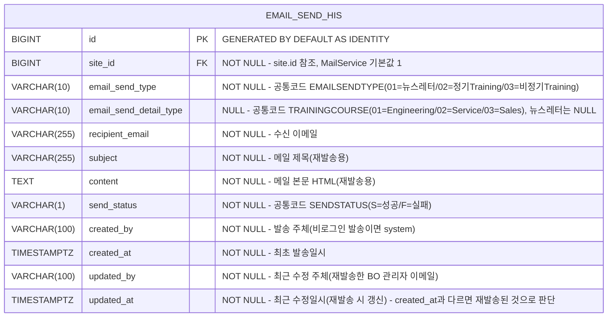

# 이메일 발송 이력(email_send_his) DB 설계서

> 현재 `emailSendHis-data`(BO 메뉴 "이메일 발송 내역")는 범용 `page_data` 테이블(JSONB, `data_slug='emailSendHis-data'`)에 저장되고 있고,
> 이 데이터가 인증 없는 FO 공개 API `GET /api/v1/fo/page-data/{slug}`로 그대로 노출되는 보안 문제가 있다(수신자 이메일/제목/본문까지 비인증 조회 가능).
> 이를 해소하기 위해 이메일 발송 이력을 전용 테이블 `email_send_his`로 분리한다.
>
> **선례**: 동일한 성격의 마이그레이션을 `trainingApplHis-data`(page_data) → `training_registration` 전용 테이블로 이미 1회 완료한 바 있다
> (엔티티: `com.ge.bo.entity.TrainingRegistration`, 컨트롤러: `TrainingRegistrationAdminController`/서비스: `TrainingRegistrationAdminService`).
> 본 설계는 `training_registration`의 컬럼 네이밍/타입/인덱스 컨벤션을 최대한 그대로 따른다.
>
> 단, `training_registration`은 **이력성 append-only**(수정 없음) 테이블인 반면, `email_send_his`는 **재발송 시 원본 행을 UPDATE**해야 하는 테이블이라는 차이가 있다.
> 따라서 감사(audit) 컬럼 패턴은 `training_registration`(단순 `created_at`만 서버에서 수동 세팅) 대신, 프로젝트 내 수정 가능한 엔티티들의 표준 패턴인
> `@CreatedBy`/`@CreatedDate`/`@LastModifiedBy`/`@LastModifiedDate` + `@EntityListeners(AuditingEntityListener.class)`(예: `BannerData`, `AdminUser`)를 채택한다.
> 이 프로젝트는 `JpaConfig`에 `AuditorAware<String>` Bean이 이미 등록되어 있어(비로그인 컨텍스트면 `"system"`, 로그인 컨텍스트면 `auth.getName()`),
> 발송 시점(비로그인 FO 플로우)엔 `created_by="system"`, 재발송 시점(로그인된 BO 관리자 API)엔 `updated_by=관리자 이메일`이 자동으로 채워진다.

---

## 1. ERD



> `site_id`는 `page_data`와 동일하게 `site(id)` 논리·물리 FK를 건다(2.1절 참고). `curriculum_id`/`session_id`처럼 다른 `page_data` 행을 참조하는 컬럼은 없다 — 이메일 이력은 그 자체로 완결된 leaf 데이터라 조인 대상이 없다.

---

## 2. 테이블 상세

### 2.1 email_send_his

| 컬럼 | 타입 | NULL | 기본값 | 설명 |
|:---|:---|:---|:---|:---|
| `id` | BIGINT | NO | GENERATED BY DEFAULT AS IDENTITY | PK |
| `site_id` | BIGINT | NO | - | 소속 사이트(`site.id` FK). `MailService.sendMail()`이 호출부에서 넘긴 값 또는 기본값(1L)을 항상 채우므로 NOT NULL(기존 `page_data.site_id`는 NULL 허용이지만, 이 테이블은 실제로 한 번도 NULL로 저장된 적이 없어 NOT NULL로 강제) |
| `email_send_type` | VARCHAR(10) | NO | - | 발송분류 — 공통코드 `EMAILSENDTYPE`(01=뉴스레터, 02=정기 Training, 03=비정기 Training) |
| `email_send_detail_type` | VARCHAR(10) | YES | NULL | 상세분류 — 공통코드 `TRAININGCOURSE`(01=Engineering/02=Service/03=Sales). Training 계열만 값이 있고 뉴스레터는 NULL |
| `recipient_email` | VARCHAR(255) | NO | - | 수신 이메일 |
| `subject` | VARCHAR(255) | NO | - | 메일 제목(재발송 시 그대로 재사용) |
| `content` | TEXT | NO | - | 메일 본문 HTML(재발송 시 그대로 재사용) |
| `send_status` | VARCHAR(1) | NO | - | 발송상태 — 공통코드 `SENDSTATUS`(S=성공/F=실패). 재발송 성공 시 이 값을 갱신 |
| `created_by` | VARCHAR(100) | NO | - | 최초 발송 주체 — `@CreatedBy`(AuditorAware). 뉴스레터/Training 신청은 전부 비로그인 FO 플로우라 실질적으로 항상 `"system"` |
| `created_at` | TIMESTAMPTZ | NO | CURRENT_TIMESTAMP | 최초 발송일시 — `@CreatedDate` |
| `updated_by` | VARCHAR(100) | NO | - | 최근 수정 주체 — `@LastModifiedBy`. 최초 insert 시엔 `created_by`와 동일값(JPA Auditing 표준 동작), 재발송 시엔 BO 로그인 관리자 이메일로 갱신 |
| `updated_at` | TIMESTAMPTZ | NO | CURRENT_TIMESTAMP | 최근 수정일시 — `@LastModifiedDate`. 최초 insert 시엔 `created_at`과 동일값, 재발송 시에만 이후 시각으로 갱신 |

> **`updated_at > created_at` = 재발송 여부 판단 기준을 그대로 유지한다.** 현재 `EmailSendHisService`가 `CASE WHEN updated_at > created_at THEN updated_at ELSE NULL END`로 "최근재발송일시"를 계산하는 방식은, JPA Auditing이 insert 시점에 `createdAt`/`updatedAt`을 **동일 시각**으로 채우는 표준 동작(`BannerData` 등 기존 엔티티와 동일)과 그대로 맞아떨어지므로 신규 테이블에서도 로직 변경 없이 재사용 가능하다.
> **`subject`/`content` NOT NULL 관련 주의(마이그레이션 대상 데이터에 한함)**: 로컬 DB의 기존 24건 중 3건(`id=2192, 2269, 2312`)은 과거 `MailService` 구현이 `subject`/`content`를 저장하지 않던 시절에 쌓인 데이터라 해당 키가 JSON에 없다. 신규 테이블은 재발송 기능상 `subject`/`content`가 필수이므로 NOT NULL로 설계하되, 이 3건은 7절 마이그레이션 SQL에서 빈 문자열로 대체한다(7.3절 참고). 이후 `MailService`는 항상 값을 채워 저장하므로 신규 데이터엔 해당 문제가 없다.

---

## 3. 인덱스 설계

`EmailSendHisService`(`getList`)가 실제로 사용하는 정렬/필터 기준을 그대로 반영한다.

| 인덱스명 | 컬럼 | 타입 | 설명 |
|:---|:---|:---|:---|
| `email_send_his_pkey` | `id` | PRIMARY | PK |
| `email_send_his_created_at_idx` | `created_at` | INDEX | 목록 기본 정렬(`ORDER BY created_at DESC`) 및 `startDate`/`endDate` 범위 필터 |
| `email_send_his_recipient_email_idx` | `recipient_email` | INDEX | 수신 이메일 키워드 검색(`ILIKE '%...%'`) 필터. `contact_us_inquiry.email` 인덱스와 동일하게 일반 btree만 적용(ILIKE 부분일치 가속엔 한계가 있으나 이 프로젝트 기존 컨벤션을 따름 — pg_trgm 등 확장 인덱스는 미도입) |
| `email_send_his_send_status_idx` | `send_status` | INDEX | 발송상태(S/F) 필터 |
| `email_send_his_email_send_type_idx` | `email_send_type` | INDEX | 발송분류(01/02/03) 필터 |

> `training_registration`처럼 컬럼당 단일 인덱스로 구성한다(복합 인덱스 미도입) — 데이터 규모가 이력성 로그 테이블 수준(현재 24건, 발송 이벤트마다 1건씩 증가)이라 과도한 인덱스 설계는 불필요하다는 기존 프로젝트 판단 기준을 그대로 따름.

---

## 4. 설계 결정 사항

| 항목 | 결정 | 이유 |
|:---|:---|:---|
| 테이블명 `email_send_his` | 확정 | 기존 `data_slug='emailSendHis-data'`와 대응되는 snake_case 테이블명. `training_registration`과 마찬가지로 `bo_`/`fo_` 접두어 없음(프로젝트 컨벤션) |
| PK `GENERATED BY DEFAULT AS IDENTITY` | ✅ | 프로젝트 DB 표준(`docs/db/identity_migration/db_identity_migration.md`) 준수, `training_registration`/`contact_us_inquiry`와 동일 |
| `created_at`/`updated_at` `TIMESTAMPTZ` | ✅ | 프로젝트 DB 표준(`docs/db/timestamptz/db_timestamptz.md`) 준수, Entity는 `OffsetDateTime` 사용 |
| 감사 컬럼을 `@CreatedBy/@CreatedDate/@LastModifiedBy/@LastModifiedDate` 자동화 패턴으로 채택 | ✅ | `training_registration`(수동 `OffsetDateTime.now()` 세팅, append-only 전제)과 달리 이 테이블은 재발송으로 인한 UPDATE가 필수 요구사항이라, 프로젝트 내 이미 검증된 mutable 엔티티 표준 패턴(`BannerData`/`AdminUser` 등 `AuditingEntityListener` 방식)을 재사용. `JpaConfig.auditorProvider()`가 비로그인 컨텍스트에서 `"system"`을 반환하므로 FO 발송 플로우에서도 NOT NULL 제약과 충돌 없음 |
| `created_by`/`updated_by` NOT NULL | ✅ | `AuditorAware`가 항상 값을 반환(`Optional.of(...)`)하므로 실질적으로 NULL이 발생하지 않음 — `BannerData`와 동일하게 NOT NULL로 강제 |
| `site_id` NOT NULL + `site(id)` FK | ✅ | `MailService.sendMail()`이 호출부 값 또는 기본값(1L, `DEFAULT_SITE_ID`)을 항상 채워 저장하며, 실측(로컬 24건) 결과도 전량 `site_id=1`로 NULL이 없음. FK는 `page_data.site_id`가 이미 `site(id)`를 참조하는 기존 컨벤션(`docs/db/site/db_site.md`)을 그대로 따름(`ON DELETE` 절 없음 — `page_data`와 동일) |
| `email_send_type`/`email_send_detail_type`/`send_status` VARCHAR + 코드값 문자열 저장 | ✅ | 물리 FK 없이 공통코드(`code_group`/`code_detail`)의 코드값만 저장 — `contact_us_inquiry.inquiry_type`과 동일 정책(코드가 추후 비활성/변경되어도 과거 이력 데이터 무결성 유지). 로컬 DB에 `EMAILSENDTYPE`/`TRAININGCOURSE`/`SENDSTATUS` 3개 그룹 모두 이미 등록되어 있음을 확인함 |
| `subject` VARCHAR(255) / `content` TEXT | ✅ | 현재 저장되는 메일 제목("Training Registration Test" 등)은 짧은 고정 문구 수준이라 VARCHAR(255)로 충분, 본문은 HTML이라 길이 제한 없는 TEXT |
| `curriculum_id`/`session_id` 같은 `page_data` 참조 컬럼 없음 | ✅ | 이메일 이력은 발송 시점의 스냅샷(수신자/제목/본문)만 저장하면 되고, 원본 신청 데이터(`training_registration`)와 조인해서 보여줄 필요가 기획/현재 화면(`bo/src/app/admin/logs/email`)에 없음(목록/상세 API 응답 필드에도 curriculum/session 관련 필드 없음) |
| `updated_at`을 "최근재발송일시" 판단 기준으로 계속 사용 | ✅ | 기존 `EmailSendHisService`/FE(`bo/src/app/admin/logs/email`)의 `updated_at > created_at` 비교 로직을 그대로 재사용 가능해 서비스 레이어 변경 최소화 |

---

## 5. DDL

```sql
CREATE TABLE IF NOT EXISTS email_send_his (
    id                      BIGINT        GENERATED BY DEFAULT AS IDENTITY PRIMARY KEY,
    site_id                 BIGINT        NOT NULL REFERENCES site(id),
    email_send_type         VARCHAR(10)   NOT NULL,
    email_send_detail_type  VARCHAR(10),
    recipient_email         VARCHAR(255)  NOT NULL,
    subject                 VARCHAR(255)  NOT NULL,
    content                 TEXT          NOT NULL,
    send_status             VARCHAR(1)    NOT NULL,
    created_by              VARCHAR(100)  NOT NULL,
    created_at              TIMESTAMPTZ   NOT NULL DEFAULT CURRENT_TIMESTAMP,
    updated_by              VARCHAR(100)  NOT NULL,
    updated_at              TIMESTAMPTZ   NOT NULL DEFAULT CURRENT_TIMESTAMP
);

CREATE INDEX IF NOT EXISTS email_send_his_created_at_idx      ON email_send_his (created_at);
CREATE INDEX IF NOT EXISTS email_send_his_recipient_email_idx ON email_send_his (recipient_email);
CREATE INDEX IF NOT EXISTS email_send_his_send_status_idx     ON email_send_his (send_status);
CREATE INDEX IF NOT EXISTS email_send_his_email_send_type_idx ON email_send_his (email_send_type);

COMMENT ON TABLE  email_send_his IS '이메일 발송 이력(뉴스레터/Training 신청·요청 메일). page_data(emailSendHis-data) FO 비인증 노출 문제로 전용 테이블 분리';
COMMENT ON COLUMN email_send_his.email_send_type IS '공통코드 EMAILSENDTYPE(01=뉴스레터/02=정기 Training/03=비정기 Training)';
COMMENT ON COLUMN email_send_his.email_send_detail_type IS '공통코드 TRAININGCOURSE(01=Engineering/02=Service/03=Sales), 뉴스레터는 NULL';
COMMENT ON COLUMN email_send_his.send_status IS '공통코드 SENDSTATUS(S=성공/F=실패)';
```

> `developer`/`local` 프로파일은 `spring.jpa.hibernate.ddl-auto=update`라 엔티티 기준으로 테이블/인덱스가 자동 생성되지만(`training_registration.sql` 안내와 동일), FK(`site_id REFERENCES site(id)`)는 자동 생성되지 않으므로 위 DDL을 1회 수동 실행하는 것을 권장한다.

---

## 6. Entity 필드 매핑 참고 (구현 STEP 대비, 이번 STEP 범위 아님)

> 아래는 이후 API 설계/구현 STEP에서 참고할 수 있도록 컬럼 ↔ Java 필드 매핑만 미리 정리한 것이며, 이번 DB 설계 STEP에서 엔티티 파일을 생성하지는 않는다.

| DB 컬럼 | Entity 필드(예상) | 비고 |
|:---|:---|:---|
| `id` | `id` | `@GeneratedValue(strategy = GenerationType.IDENTITY)` |
| `site_id` | `siteId` | `Long`, scalar 컬럼(FK는 DB 레벨만, `@ManyToOne` 불필요 — `TrainingRegistration.curriculumId`와 동일 정책) |
| `email_send_type` | `emailSendType` | |
| `email_send_detail_type` | `emailSendDetailType` | nullable |
| `recipient_email` | `recipientEmail` | |
| `subject` | `subject` | |
| `content` | `content` | |
| `send_status` | `sendStatus` | 재발송 시 갱신 필요 → `@Setter` 또는 전용 update 메서드 필요(현재 `EmailSendHisResponse`/`EmailSendHisDetailResponse` DTO/컨트롤러 시그니처는 이번 STEP에서 변경하지 않음) |
| `created_by` | `createdBy` | `@CreatedBy` |
| `created_at` | `createdAt` | `@CreatedDate` |
| `updated_by` | `updatedBy` | `@LastModifiedBy` |
| `updated_at` | `updatedAt` | `@LastModifiedDate` |

---

## 7. 데이터 마이그레이션

### 7.1 대상 데이터 현황(로컬 DB 실측, 2026-08-07 기준)

```sql
SELECT COUNT(*) FROM page_data WHERE data_slug = 'emailSendHis-data';
-- 24
```

전량 `site_id = 1`, `created_by`/`updated_by`는 전량 NULL(현행 `MailService.saveEmailSendHistory()`가 `created_by=NULL, updated_by=NULL`로 insert하기 때문). `id=2317`, `id=2318` 2건은 `updated_at > created_at`으로, 실제 재발송이 발생했던 이력임을 확인함. `id=2192`, `2269`, `2312` 3건은 `subject`/`content`/`emailSendDetailType` 키 자체가 JSON에 없는 구버전 데이터임.

### 7.2 JSONB → 컬럼 매핑

| `page_data` 소스 | `email_send_his` 대상 컬럼 | 매핑 규칙 |
|:---|:---|:---|
| `id` | `id` | 그대로 보존(7.3절 참고 — ID 연속성 유지) |
| `site_id` | `site_id` | 그대로 |
| `data_json->'emailSendHis'->>'emailSendType'` | `email_send_type` | 그대로 |
| `data_json->'emailSendHis'->>'emailSendDetailType'` | `email_send_detail_type` | 없으면 NULL |
| `data_json->'emailSendHis'->>'recipientEmail'` | `recipient_email` | 그대로 |
| `data_json->'emailSendHis'->>'subject'` | `subject` | 없으면 빈 문자열(`''`)로 대체 — NOT NULL 제약, 2.1절 주의사항 참고 |
| `data_json->'emailSendHis'->>'content'` | `content` | 없으면 빈 문자열(`''`)로 대체 |
| `data_json->'emailSendHis'->>'sendStatus'` | `send_status` | 그대로 |
| `created_by` | `created_by` | NULL이면 `'system'`으로 대체(NOT NULL 제약) |
| `created_at` | `created_at` | 그대로 |
| `updated_by` | `updated_by` | NULL이면 `created_by` 대체값을 그대로 사용(`'system'`) |
| `updated_at` | `updated_at` | 그대로 — `updated_at > created_at`인 2건(재발송 이력)은 값 그대로 이관되어야 "재발송됨" 판정이 마이그레이션 후에도 유지됨 |

> `sentAt`/`lastResendAt`(JSON 내부 문자열 필드)은 별도 컬럼으로 옮기지 않는다 — 이미 `page_data.created_at`/`updated_at`(TIMESTAMPTZ)이 각각 같은 의미의 값을 갖고 있고, 신규 테이블도 동일하게 `created_at`/`updated_at`으로 그 역할을 대체하기 때문(정보 손실 없음, 컬럼 중복만 제거).

### 7.3 이관 SQL (초안)

**ID 연속성**: 기존 `id`(예: 2192~2333)를 새 테이블에서도 그대로 유지할지, 새 IDENTITY 시퀀스로 1부터 재채번할지는 선택 사항이다. 아래는 **기존 id를 보존**하는 안(추천) — `GENERATED BY DEFAULT AS IDENTITY`는 `OVERRIDING SYSTEM VALUE` 없이도 명시적 id 삽입이 가능하며, 이관 후 시퀀스만 재조정하면 된다. BO 관리자 화면에서 이미 특정 id로 접근/재발송 테스트를 해본 이력이 있어(위 2317/2318), id를 보존하면 이관 전후 추적이 쉽다는 장점이 있다.

```sql
BEGIN;

INSERT INTO email_send_his
    (id, site_id, email_send_type, email_send_detail_type, recipient_email, subject, content, send_status,
     created_by, created_at, updated_by, updated_at)
SELECT
    id,
    site_id,
    data_json->'emailSendHis'->>'emailSendType',
    data_json->'emailSendHis'->>'emailSendDetailType',
    data_json->'emailSendHis'->>'recipientEmail',
    COALESCE(data_json->'emailSendHis'->>'subject', ''),
    COALESCE(data_json->'emailSendHis'->>'content', ''),
    data_json->'emailSendHis'->>'sendStatus',
    COALESCE(created_by, 'system'),
    created_at,
    COALESCE(updated_by, created_by, 'system'),
    updated_at
FROM page_data
WHERE data_slug = 'emailSendHis-data'
ORDER BY id;

-- IDENTITY 시퀀스를 이관된 최대 id 이후로 재조정 (명시적 id 삽입 후 필수)
SELECT setval(pg_get_serial_sequence('email_send_his', 'id'),
              COALESCE((SELECT MAX(id) FROM email_send_his), 1));

-- 건수 대조 (24건 = 24건이어야 정상)
SELECT
    (SELECT COUNT(*) FROM page_data WHERE data_slug = 'emailSendHis-data') AS source_count,
    (SELECT COUNT(*) FROM email_send_his) AS target_count;

COMMIT;
```

> id를 보존하지 않고 새로 채번하고 싶다면 `INSERT INTO email_send_his (site_id, ...) SELECT site_id, ... ORDER BY id;`처럼 `id` 컬럼과 `SELECT id,`만 빼면 된다(이 경우 setval 재조정 불필요, DB가 자동 채번).

---

## 8. 마이그레이션 후 `page_data` 정리 방안 (제안 — 최종 판단은 사용자 몫)

이관이 끝나고 애플리케이션 코드(`MailService`/`EmailSendHisService`)가 새 테이블을 쓰도록 전환된 뒤에는, `page_data`에 남아있는 `data_slug='emailSendHis-data'` 24건이 계속 FO 공개 API로 노출되는 문제가 그대로 남는다. 아래 방안 중 선택이 필요하다.

| 방안 | 내용 | 장단점 |
|:---|:---|:---|
| **A. 완전 삭제(추천)** | `DELETE FROM page_data WHERE data_slug = 'emailSendHis-data';` | 보안 문제(FO 비인증 노출)를 물리적으로 완전히 제거. 이관 검증(건수 대조, 신규 테이블 조회 정상 동작 확인)을 마친 뒤에만 실행해야 함. 테스트 환경 데이터라 CLAUDE.md 규칙상 값 삭제 자체는 승인 절차 없이도 가능하나, **이 DELETE는 코드 전환(STEP 6 서비스/컨트롤러 변경) 완료 후에 실행해야** 새 테이블 기준으로 정상 서비스되는 상태에서 지워진다 |
| **B. slug_registry 비활성화만** | `slug_registry`의 `emailSendHis-list`(PAGE_TEMPLATE)/`emailSendHis-data`(PAGE_DATA) 행을 `active=false`로 변경, `page_data` 행은 보존 | 원본 데이터를 남겨두고 싶을 때 선택. 단, `FoPageDataController`가 `slug_registry.active` 여부와 무관하게 조회를 허용하는지 확인이 별도로 필요함(현재 코드 미확인) — active 체크가 없다면 이 방안은 보안 문제를 해결하지 못함 |
| **C. 보존만 하고 방치** | 아무 것도 안 함 | 비추천 — 새 테이블로 조회 경로를 옮겨도 `page_data`의 원본 행이 그대로 FO 공개 API에 노출되는 문제가 전혀 해결되지 않음 |

> A안을 택할 경우 `page_data`뿐 아니라 `slug_registry`의 `emailSendHis-list`/`emailSendHis-data` 두 행도 함께 정리할지(삭제 또는 비활성화) 별도로 결정이 필요하다 — 이 문서 범위는 `email_send_his` 테이블 설계까지이므로, `slug_registry` 처리 방식은 해당 STEP 승인 시점에 다시 확인 요청 예정.

---

## 9. 요약

| 구분 | 내용 |
|:---|:---|
| 신규 테이블 | `email_send_his` (site_id, email_send_type, email_send_detail_type, recipient_email, subject, content, send_status + 감사 4컬럼) |
| 감사 컬럼 패턴 | `training_registration`(수동 append-only)이 아닌 `BannerData`(`@CreatedBy/@CreatedDate/@LastModifiedBy/@LastModifiedDate` 자동화) 패턴 채택 — 재발송 UPDATE 요건 때문 |
| 인덱스 | `created_at`, `recipient_email`, `send_status`, `email_send_type` 단일 컬럼 인덱스 4개 (컬럼당 1개, `training_registration` 컨벤션) |
| 마이그레이션 대상 | 로컬 DB 실측 24건, 전량 `site_id=1`/`created_by`,`updated_by` NULL, 3건은 `subject`/`content` 없음(구버전 데이터, 빈 문자열로 대체) |
| `page_data` 정리 | 코드 전환 완료 후 `DELETE`를 추천하나 최종 결정은 사용자 승인 필요 |
