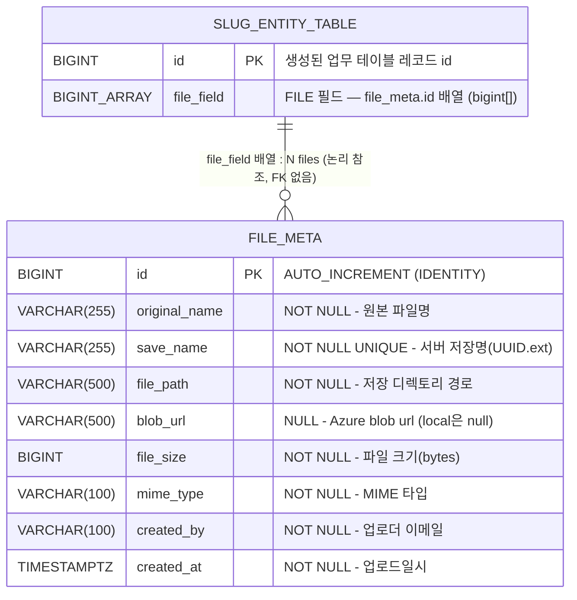

# Entity 파일 필드 — file_meta DB 설계서

- **기능명**: entity Form FILE 필드의 file_meta 정식 전환 (로드맵 3단계 — 파일업로드와 수정모드 복원)
- **작성일**: 2026-07-12
- **작업 분류**: Rule 0 BE포함 작업 STEP 3 (DB 문서)
- **변경 요약**: entity Form의 FILE 필드를 그동안 우회 사용하던 `page_file`(page_data 전용) 테이블 대신, entity가 원래 의도한 전용 `file_meta` 테이블 기반으로 정식 전환한다. 3단계에서 FE 다건 조회(파일명/미리보기)와 이미지·비디오 blob 다운로드 기능을 추가한다.
- **결론(스키마 변경)**: **스키마 변경 없음 — 기존 `file_meta` 구조로 충분.** 신규 기능은 모두 Service/Controller/DTO 계층에서 기존 컬럼만으로 구현 가능하다. (근거는 §4 참조)
- **참조 문서**:
  - `docs/db/slug-entity/db_slug-entity.md` (FILE column_type → `file_meta.id` 배열 매핑 근거)
  - `docs/db/layer/db_layer_file-upload.md` (기존 우회 대상이던 `page_file` 설계서 — 대조용)

---

## 1. 배경 — 왜 page_file에서 file_meta로 전환하는가

| 구분 | `page_file` (기존 우회) | `file_meta` (정식 전환 대상) |
|:---|:---|:---|
| 소유(owner) 컬럼 | `template_slug` / `data_id` / `field_key` 보유 | 없음 (독립 메타 테이블) |
| 대상 | page_data(레이어 팝업 빌더) 전용 | Slug Entity FILE 타입 필드 범용 |
| id 네임스페이스 | page_data 문맥에 종속 | entity 레코드가 직접 `file_meta.id` 배열 보유 |

- link 단계에서 **entity 레코드 id와 page_data id 네임스페이스 충돌**(Critical)이 발견되어, entity FILE 필드를 page_file로 우회하던 방식을 폐기한다.
- Slug Entity의 `column_type=FILE` 필드는 설계상(§slug-entity 문서 2.4) 이미 `List<Long>` / `BIGINT[]` = `file_meta.id` 목록을 담도록 매핑되어 있다. 즉 **entity가 원래 바라보던 테이블이 file_meta**이며, 이번 작업은 그 원래 계약으로 복귀하는 것이다.

---

## 2. ERD



> **참조 방식**: entity 업무 테이블의 FILE 필드(`bigint[]`)가 `file_meta.id`를 **논리적으로** 참조한다. `page_file`과 달리 file_meta는 owner 컬럼이 없으며, 참조 방향이 반대(entity 레코드가 파일 id 배열을 보유)다. 배열 컬럼에는 FK 제약이 없어 참조무결성은 애플리케이션 레벨에서 관리한다(slug-entity 문서 §2.4 배열 매핑 방침과 동일).

---

## 3. 테이블 상세 — file_meta (현재 구조, 변경 없음)

엔티티: `bo-api/src/main/java/com/ge/bo/entity/FileMeta.java`

| 컬럼 | 타입 | NULL | 기본값 | 설명 |
|:---|:---|:---|:---|:---|
| `id` | BIGINT | NO | IDENTITY | PK |
| `original_name` | VARCHAR(255) | NO | - | 사용자가 업로드한 원본 파일명 (예: `report.pdf`) |
| `save_name` | VARCHAR(255) | NO | - | 서버 저장명 — UUID + 원본 확장자 (예: `a3f2c1d4.pdf`), UNIQUE |
| `file_path` | VARCHAR(500) | NO | - | 저장 디렉토리 경로 (예: `/uploads/file-meta/2026/07/`) |
| `blob_url` | VARCHAR(500) | YES | NULL | Azure Blob Storage url — local 환경에서는 NULL |
| `file_size` | BIGINT | NO | - | 파일 크기 (bytes) |
| `mime_type` | VARCHAR(100) | NO | - | MIME 타입 (예: `application/pdf`, `image/jpeg`, `video/mp4`) |
| `created_by` | VARCHAR(100) | NO | - | 업로드한 관리자 이메일 (JPA `@CreatedBy` Auditing) |
| `created_at` | TIMESTAMPTZ | NO | NOW() | 업로드일시 (JPA `@CreatedDate` Auditing, `updatable=false`) |

**인덱스:**

| 인덱스명 | 컬럼 | 타입 | 설명 |
|:---|:---|:---|:---|
| PK_FILE_META | `id` | PRIMARY | PK |
| UQ_FILE_META_SAVE_NAME | `save_name` | UNIQUE | 저장명 중복 방지 (UUID 기반) |

---

## 4. 이번 작업의 스키마 변경 여부와 근거

### 4.1 결론

> **스키마 변경 없음. 기존 `file_meta` 테이블 구조로 3단계 신규 기능을 모두 지원할 수 있다.**
> 컬럼 추가·인덱스 추가·타입 변경 모두 불필요하다.

### 4.2 3단계 신규 기능 vs 현재 지원 현황

현재 코드가 제공하는 기능 (재확인 결과):

| 기능 | 위치 | 제공 여부 |
|:---|:---|:---|
| 파일 단건 업로드 | `FileMetaController.upload` / `FileMetaService.upload` (`POST /api/v1/file-meta/upload`) | 제공 |
| 메타 단건 조회 | `FileMetaController.getOne` / `FileMetaService.getOne` (`GET /api/v1/file-meta/{id}`) | 제공 |
| **다건(일괄) 조회** | 없음 — Controller에 엔드포인트 없음. `FileMetaRepository`는 `JpaRepository` 기본 상속만 있어 커스텀 조회 미노출 | **없음(신규 필요)** |
| **파일 blob 다운로드** | 없음 — 실제 파일 바이트를 내려주는 엔드포인트 없음. `FileMetaResponse`는 `blobUrl`만 노출(local은 null)하고 `save_name`/`file_path` 미노출 | **없음(신규 필요)** |

### 4.3 신규 기능이 스키마 변경을 요구하지 않는 근거

**(1) 다건 조회 — FE가 파일 id 여러 개로 파일명/미리보기 조회**
- 조회 키는 PK(`id IN (...)`)이며, `JpaRepository.findAllById(ids)`로 즉시 처리 가능 → PK 인덱스 사용, **추가 인덱스 불필요**.
- FE가 미리보기에 필요한 값(`original_name`, `mime_type`, `file_size`, `blob_url`, `created_at`)은 모두 기존 컬럼에 존재.
- 구현은 Service 메서드 + Controller 엔드포인트(예: `GET /api/v1/file-meta?ids=1,2,3`) 추가로 충분 → **스키마 무관**.

**(2) blob 다운로드 — 이미지/비디오 실제 파일 내려주기**
- 서버가 물리 파일을 특정하는 데 필요한 정보가 이미 스키마에 존재한다:
  - 파일시스템: `file_path`(디렉토리) + `save_name`(파일명) → 전체 경로 복원 가능.
  - Azure blob: `blob_url`로 원본 위치 확보 가능.
- 브라우저 렌더링에 필요한 `mime_type`(Content-Type), 다운로드 파일명 표기용 `original_name`, `file_size`(Content-Length)도 모두 존재.
- 다운로드 엔드포인트는 엔티티를 직접 조회(`findById`)해 `file_path`+`save_name`으로 파일을 읽어 스트리밍하면 되므로, DTO에 `save_name`/`file_path`를 노출할지 여부는 **응답 DTO 설계 문제이지 테이블 스키마 문제가 아니다** → **스키마 무관**.

### 4.4 이번 스키마 변경이 아닌, 후속 개발 계층에서 다룰 사항 (참고)

> 아래는 DB 변경이 아니라 STEP 4~5(API/FE 설계·개발)에서 결정할 사항이다. 본 DB 문서의 결론(스키마 변경 없음)에는 영향을 주지 않는다.

- 다건 조회 엔드포인트 신설 (Service/Controller) — 기존 컬럼만 사용.
- 파일 blob 다운로드 엔드포인트 신설 — `file_path`+`save_name`으로 물리 파일 스트리밍(local) 및 `blob_url` 프록시/리다이렉트(blob) 분기.
- `FileMetaResponse`에 다운로드 URL(예: `/api/v1/file-meta/{id}/download`) 파생값을 실어줄지 여부 — DTO 레벨 결정.

---

## 5. 파일 저장 경로 규칙 (현재 구현 그대로)

```
{upload-root}/file-meta/{YYYY}/{MM}/{save_name}
예) /uploads/file-meta/2026/07/a3f2c1d4.pdf
```

- `save_name` = `UUID.randomUUID() + "." + 원본확장자(소문자)` — 전역 UNIQUE.
- 연월 디렉토리 자동 생성 (`FileMetaService.upload`).
- 저장 방식은 `application.yml`의 `ls.file-storage` 값으로 분기: `blob`이면 Azure Blob Storage 업로드(`blob_url` 채움), 그 외에는 파일시스템 저장(`blob_url` NULL).

---

## 6. DDL (참고 — `ddl-auto: update`로 JPA Entity 기반 자동 생성)

```sql
CREATE TABLE file_meta (
    id            BIGINT GENERATED ALWAYS AS IDENTITY PRIMARY KEY,
    original_name VARCHAR(255) NOT NULL,
    save_name     VARCHAR(255) NOT NULL,
    file_path     VARCHAR(500) NOT NULL,
    blob_url      VARCHAR(500),
    file_size     BIGINT       NOT NULL,
    mime_type     VARCHAR(100) NOT NULL,
    created_by    VARCHAR(100) NOT NULL,
    created_at    TIMESTAMPTZ  NOT NULL DEFAULT NOW(),

    CONSTRAINT uq_file_meta_save_name UNIQUE (save_name)
);
```

> 이번 3단계에서 위 DDL에 대한 **ALTER(컬럼/인덱스 추가)는 없다.**

---

## 7. 관련 파일 경로

| 계층 | 파일 경로 |
|:---|:---|
| Entity | `bo-api/src/main/java/com/ge/bo/entity/FileMeta.java` |
| Repository | `bo-api/src/main/java/com/ge/bo/repository/FileMetaRepository.java` |
| Service | `bo-api/src/main/java/com/ge/bo/service/FileMetaService.java` |
| Controller | `bo-api/src/main/java/com/ge/bo/controller/FileMetaController.java` |
| Response DTO | `bo-api/src/main/java/com/ge/bo/dto/FileMetaResponse.java` |
| 파일 저장 공통 | `bo-api/src/main/java/com/ge/bo/common/file/FileStorageService.java` |
| 연관 설계서 | `docs/db/slug-entity/db_slug-entity.md` (FILE 매핑), `docs/db/layer/db_layer_file-upload.md` (page_file 대조) |
