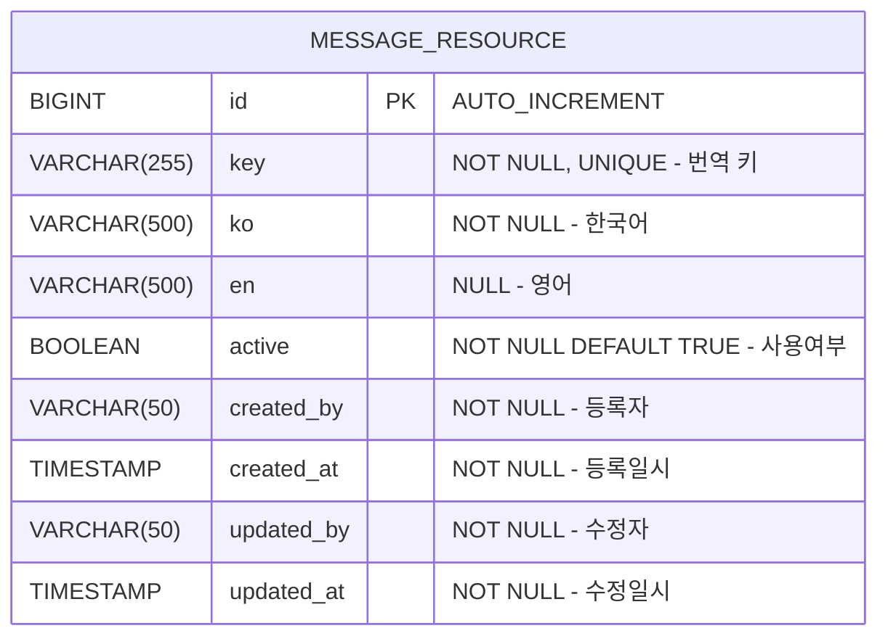

# 다국어 관리 DB 설계서

- **버전:** v1
- **작성일:** 2026-05-18
- **작성자:** Architect Agent
- **상태:** 작성 완료

---

## 1. 개요

시스템에서 사용하는 다국어 번역 항목을 관리하기 위한 데이터베이스 설계입니다.
번역 키(key)를 기준으로 한국어·영어 텍스트를 저장하며, 추후 빌더 필드 라벨 등 다양한 영역에 연동 확장 예정입니다.

---

## 2. ERD



---

## 3. 테이블 정의: `message_resource`

| 컬럼명 | 논리명 | 타입 | Nullable | PK/UK | 기본값 | 설명 |
|:---|:---|:---|:---:|:---:|:---:|:---|
| `id` | 식별자 | BIGINT | N | PK | AI | Auto Increment |
| `key` | 번역키 | VARCHAR(255) | N | UK | | 영문·숫자·점(.)만 허용 (e.g. `BTN.SAVE`) |
| `ko` | 한국어 | VARCHAR(500) | N | | | 한국어 번역 텍스트 |
| `en` | 영어 | VARCHAR(500) | Y | | NULL | 영어 번역 텍스트 (미입력 허용) |
| `active` | 사용여부 | BOOLEAN | N | | TRUE | true: 사용, false: 미사용 |
| `created_by` | 등록자 | VARCHAR(50) | N | | | JWT 토큰에서 추출한 관리자 ID |
| `created_at` | 등록일시 | TIMESTAMP | N | | CURRENT_TIMESTAMP | JPA Auditing 자동 관리 |
| `updated_by` | 수정자 | VARCHAR(50) | N | | | JWT 토큰에서 추출한 관리자 ID |
| `updated_at` | 수정일시 | TIMESTAMP | N | | CURRENT_TIMESTAMP | JPA Auditing 자동 관리 |

---

## 4. 인덱스 설계

| 인덱스명 | 컬럼 | 종류 | 목적 |
|:---|:---|:---|:---|
| `message_resource_pkey` | `id` | PRIMARY | 기본 식별 |
| `message_resource_key_key` | `key` | UNIQUE | 번역 키 중복 방지 |
| `message_resource_active_idx` | `active` | INDEX | 사용여부 필터링 최적화 |

---

## 5. 제약 사항

- `key`는 중복될 수 없으며 영문(대소문자)·숫자·점(`.`)만 허용 — 앱 레벨 정규식: `/^[a-zA-Z0-9.]+$/`
- `key`는 등록 후 변경 불가 — 수정 API에서 key 필드 제외 처리
- `ko`(한국어)는 필수 입력, `en`(영어)는 선택 입력
- `active` 기본값 TRUE — 등록 시 즉시 사용 상태
- `created_by`, `updated_by`는 JWT 토큰에서 추출한 관리자 ID로 자동 설정
- `created_at`, `updated_at`은 JPA Auditing(`@CreatedDate`, `@LastModifiedDate`)으로 자동 관리

---

## 6. DDL

```sql
CREATE TABLE message_resource (
    id          BIGINT AUTO_INCREMENT PRIMARY KEY,
    `key`       VARCHAR(255) NOT NULL UNIQUE,
    ko          VARCHAR(500) NOT NULL,
    en          VARCHAR(500),
    active      BOOLEAN NOT NULL DEFAULT TRUE,
    created_by  VARCHAR(50) NOT NULL,
    created_at  TIMESTAMP NOT NULL DEFAULT CURRENT_TIMESTAMP,
    updated_by  VARCHAR(50) NOT NULL,
    updated_at  TIMESTAMP NOT NULL DEFAULT CURRENT_TIMESTAMP ON UPDATE CURRENT_TIMESTAMP,

    INDEX message_resource_active_idx (active)
);
```

> `ddl-auto: update` 설정으로 JPA Entity 작성 시 자동 생성됩니다. DDL은 참고용입니다.
> `key`는 MySQL 예약어이므로 백틱(`` ` ``)으로 감싸서 사용합니다.
