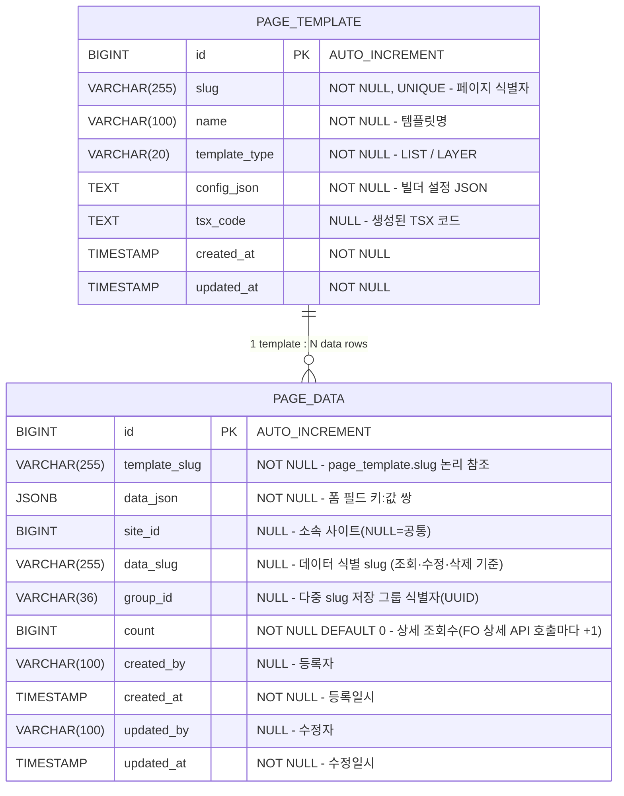

# 페이지 데이터 DB 설계서

## 1. ERD



> **참조 방식**: `template_slug`는 `page_template.slug`를 **논리적으로** 참조합니다.
> DB FK 제약은 의도적으로 적용하지 않음 — 템플릿이 삭제되어도 실데이터는 보존해야 하기 때문.

---

## 2. 테이블 상세

### 2.1 page_data

| 컬럼 | 타입 | NULL | 기본값 | 설명 |
|:---|:---|:---|:---|:---|
| `id` | BIGINT | NO | AUTO_INCREMENT | PK |
| `template_slug` | VARCHAR(255) | NO | - | 어떤 페이지의 데이터인지 식별 (ex: `user-list`) |
| `data_json` | JSONB | NO | - | 폼 필드 데이터 전체 (`{ "name": "홍길동", "status": "active" }`) |
| `site_id` | BIGINT | YES | NULL | 소속 사이트 (NULL = 공통, 값 있으면 해당 사이트 전용) |
| `data_slug` | VARCHAR(255) | YES | NULL | 데이터 식별 slug — 조회·수정·삭제 기준 (기존 `template_slug` 역할 계승) |
| `group_id` | VARCHAR(36) | YES | NULL | 다중 slug 저장 그룹 식별자(UUID) — 단일 slug 저장 시 NULL |
| `count` | BIGINT | NO | 0 | 상세 조회수 — FO 상세 API(`GET .../{id}`)와 무관하게, 별도 증가 API(`POST .../{id}/view-count`) 호출 시마다 +1. 중복방지 없음(무조건 +1) |
| `created_by` | VARCHAR(100) | YES | NULL | 등록자 (로그인한 관리자 이메일) |
| `created_at` | TIMESTAMP | NO | CURRENT_TIMESTAMP | 등록일시 |
| `updated_by` | VARCHAR(100) | YES | NULL | 수정자 (로그인한 관리자 이메일) |
| `updated_at` | TIMESTAMP | NO | CURRENT_TIMESTAMP | 수정일시 |

> `count`는 `insertable=false, updatable=false`로 엔티티에 매핑되어 일반 저장(create/update) 플로우에서는 절대 값이 바뀌지 않는다 — 오직 조회수 증가 API의 원자적 `UPDATE ... SET "count" = "count" + 1`로만 변경된다(`count`는 PostgreSQL 예약어라 네이티브 쿼리에서 큰따옴표 인용 필요).

**인덱스:**

| 인덱스명 | 컬럼 | 타입 | 설명 |
|:---|:---|:---|:---|
| PK_PAGE_DATA | `id` | PRIMARY | PK |
| IDX_PAGE_DATA_SLUG | `template_slug` | INDEX | slug별 데이터 조회 최적화 |
| IDX_PAGE_DATA_SLUG_CREATED | `template_slug, created_at DESC` | INDEX | 목록 최신순 정렬 최적화 |

---

## 3. JSONB 구조 예시

`data_json` 컬럼은 페이지 메이커에서 정의한 필드 키:값 쌍을 저장합니다.
키는 빌더에서 설정한 `fieldKey` 또는 라벨의 camelCase 변환값입니다.

```json
{
  "name": "홍길동",
  "email": "hong@example.com",
  "status": "active",
  "joinDate": "2026-03-27",
  "memo": "특이사항 없음"
}
```

**검색 방식별 JSONB 쿼리:**

| 필드 타입 | 검색 방식 | SQL 예시 |
|:---|:---|:---|
| input / textarea | 부분 일치 (ILIKE) | `data_json->>'name' ILIKE '%홍%'` |
| select / radio | 정확 일치 | `data_json->>'status' = 'active'` |
| date | 범위 검색 (추후 확장) | `data_json->>'joinDate' >= '2026-01-01'` |
| 빈 값 | 조건 제외 | WHERE 절에서 생략 |

---

## 4. 제약 사항

- `template_slug`와 `page_template.slug`는 논리적으로 동일한 값을 사용하며, 애플리케이션 레벨에서 일관성 유지
- `data_json`은 빈 객체(`{}`)를 허용하지 않으며, 최소 1개 이상의 필드를 포함해야 함
- `created_at`, `updated_at`은 JPA Auditing으로 자동 관리
- `created_by`, `updated_by`는 JWT 토큰에서 추출한 이메일로 자동 설정

---

## 5. DDL

```sql
-- 페이지 데이터 테이블 (PostgreSQL)
CREATE TABLE page_data (
    id          BIGSERIAL PRIMARY KEY,
    template_slug VARCHAR(255) NOT NULL,
    data_json   JSONB NOT NULL DEFAULT '{}',
    site_id     BIGINT,
    data_slug   VARCHAR(255),
    group_id    VARCHAR(36),
    "count"     BIGINT NOT NULL DEFAULT 0,
    created_by  VARCHAR(100),
    created_at  TIMESTAMP NOT NULL DEFAULT CURRENT_TIMESTAMP,
    updated_by  VARCHAR(100),
    updated_at  TIMESTAMP NOT NULL DEFAULT CURRENT_TIMESTAMP
);

-- 기존 테이블에 count 컬럼만 추가할 때(신규 컬럼 반영)
ALTER TABLE page_data ADD COLUMN "count" BIGINT NOT NULL DEFAULT 0;

-- 인덱스
CREATE INDEX idx_page_data_slug
    ON page_data (template_slug);

CREATE INDEX idx_page_data_slug_created
    ON page_data (template_slug, created_at DESC);
```

> `ddl-auto: update`는 신규 컬럼을 `ALTER TABLE ... ADD COLUMN ... NOT NULL`로 자동 생성 시도하는데, PostgreSQL은 **기존 행이 있는 테이블에 DEFAULT 없는 NOT NULL 컬럼 추가를 거부**한다(`count`처럼 DEFAULT를 지정해도 Hibernate가 생성하는 ALTER 구문엔 DEFAULT절이 빠져 있어 동일하게 실패). 따라서 로컬(`application-local.yml`)이든 배포(`application-dev.yml`, `ddl-auto: validate`)든 **데이터가 이미 있는 테이블에 컬럼을 추가할 때는 위 `ALTER TABLE` DDL을 항상 수동으로 먼저 실행**해야 한다(프로젝트에 Flyway/Liquibase 등 마이그레이션 도구 없음 — 수동 DDL이 유일한 방법). 로컬 실행 시 이 DDL을 빠뜨리면 서버는 정상 기동되지만 해당 컬럼을 쓰는 API가 500 에러를 낸다.
