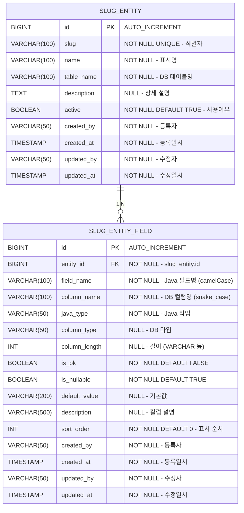

# Slug Entity DB 설계서

## 1. ERD



## 2. 테이블 상세

### 2.1 slug_entity

| 컬럼 | 타입 | NULL | 기본값 | 설명 |
|:---|:---|:---|:---|:---|
| `id` | BIGINT | NO | AUTO_INCREMENT | PK |
| `slug` | VARCHAR(100) | NO | - | 식별자 (시스템 내 유일, 예: member) |
| `name` | VARCHAR(100) | NO | - | 표시명 (예: 회원) |
| `table_name` | VARCHAR(100) | NO | - | 매핑되는 DB 테이블명 (예: tb_member) |
| `description` | TEXT | YES | NULL | 상세 설명 |
| `active` | BOOLEAN | NO | TRUE | 사용여부 |
| `created_by` | VARCHAR(50) | NO | - | 등록자 ID |
| `created_at` | TIMESTAMP | NO | CURRENT_TIMESTAMP | 등록일시 |
| `updated_by` | VARCHAR(50) | NO | - | 수정자 ID |
| `updated_at` | TIMESTAMP | NO | CURRENT_TIMESTAMP | 수정일시 |

**인덱스:**
| 인덱스명 | 컬럼 | 타입 | 설명 |
|:---|:---|:---|:---|
| PK_SLUG_ENTITY | `id` | PRIMARY | PK |
| UQ_SLUG_ENTITY_SLUG | `slug` | UNIQUE | slug 중복 방지 |

---

### 2.2 slug_entity_field

| 컬럼 | 타입 | NULL | 기본값 | 설명 |
|:---|:---|:---|:---|:---|
| `id` | BIGINT | NO | AUTO_INCREMENT | PK |
| `entity_id` | BIGINT | NO | - | FK → slug_entity.id |
| `field_name` | VARCHAR(100) | NO | - | Java 필드명 (camelCase, 예: memberName) |
| `column_name` | VARCHAR(100) | NO | - | DB 컬럼명 (snake_case, 예: member_name) |
| `java_type` | VARCHAR(50) | NO | - | Java 타입 (String / Long / Integer / Boolean / LocalDateTime / BigDecimal) |
| `column_type` | VARCHAR(50) | YES | NULL | DB 타입 (VARCHAR / BIGINT / INT / BOOLEAN / TIMESTAMP / NUMERIC) |
| `column_length` | INT | YES | NULL | 길이 (VARCHAR 등 길이 있는 타입에만 사용) |
| `is_pk` | BOOLEAN | NO | FALSE | PK 여부 |
| `is_nullable` | BOOLEAN | NO | TRUE | NULL 허용 여부 |
| `default_value` | VARCHAR(200) | YES | NULL | 기본값 |
| `description` | VARCHAR(500) | YES | NULL | 컬럼 설명 |
| `sort_order` | INT | NO | 0 | 필드 표시 순서 |
| `created_by` | VARCHAR(50) | NO | - | 등록자 ID |
| `created_at` | TIMESTAMP | NO | CURRENT_TIMESTAMP | 등록일시 |
| `updated_by` | VARCHAR(50) | NO | - | 수정자 ID |
| `updated_at` | TIMESTAMP | NO | CURRENT_TIMESTAMP | 수정일시 |

**인덱스:**
| 인덱스명 | 컬럼 | 타입 | 설명 |
|:---|:---|:---|:---|
| PK_SLUG_ENTITY_FIELD | `id` | PRIMARY | PK |
| IDX_SLUG_ENTITY_FIELD_ENTITY | `entity_id` | INDEX | entity 기준 필드 목록 조회 |

---

### 2.3 java_type 허용값

| java_type | column_type 예시 | 설명 |
|:---|:---|:---|
| `String` | VARCHAR | 문자열 |
| `Long` | BIGINT | 64비트 정수 |
| `Integer` | INT | 32비트 정수 |
| `Boolean` | BOOLEAN | 불리언 |
| `LocalDateTime` | TIMESTAMP | 날짜+시간 |
| `LocalDate` | DATE | 날짜 |
| `BigDecimal` | NUMERIC | 금액/소수 |

## 3. DDL

```sql
-- slug_entity 테이블
CREATE TABLE slug_entity (
    id          BIGINT GENERATED ALWAYS AS IDENTITY PRIMARY KEY,
    slug        VARCHAR(100) NOT NULL,
    name        VARCHAR(100) NOT NULL,
    table_name  VARCHAR(100) NOT NULL,
    description TEXT,
    active      BOOLEAN      NOT NULL DEFAULT TRUE,
    created_by  VARCHAR(50)  NOT NULL,
    created_at  TIMESTAMPTZ  NOT NULL DEFAULT NOW(),
    updated_by  VARCHAR(50)  NOT NULL,
    updated_at  TIMESTAMPTZ  NOT NULL DEFAULT NOW(),

    CONSTRAINT uq_slug_entity_slug UNIQUE (slug)
);

-- slug_entity_field 테이블
CREATE TABLE slug_entity_field (
    id             BIGINT GENERATED ALWAYS AS IDENTITY PRIMARY KEY,
    entity_id      BIGINT       NOT NULL REFERENCES slug_entity(id) ON DELETE CASCADE,
    field_name     VARCHAR(100) NOT NULL,
    column_name    VARCHAR(100) NOT NULL,
    java_type      VARCHAR(50)  NOT NULL,
    column_type    VARCHAR(50),
    column_length  INT,
    is_pk          BOOLEAN      NOT NULL DEFAULT FALSE,
    is_nullable    BOOLEAN      NOT NULL DEFAULT TRUE,
    default_value  VARCHAR(200),
    description    VARCHAR(500),
    sort_order     INT          NOT NULL DEFAULT 0,
    created_by     VARCHAR(50)  NOT NULL,
    created_at     TIMESTAMPTZ  NOT NULL DEFAULT NOW(),
    updated_by     VARCHAR(50)  NOT NULL,
    updated_at     TIMESTAMPTZ  NOT NULL DEFAULT NOW()
);

CREATE INDEX idx_slug_entity_field_entity ON slug_entity_field(entity_id);
```

## 4. 설계 결정 사항

- **slug UNIQUE 제약**: slug_registry와 동일하게 DB 레벨 UNIQUE 인덱스 적용. slug는 등록 후 수정 불가.
- **ON DELETE CASCADE**: slug_entity 삭제 시 하위 slug_entity_field 전체 자동 삭제.
- **java_type 고정 목록**: String / Long / Integer / Boolean / LocalDateTime / LocalDate / BigDecimal 7가지로 제한. 변동 가능성 낮아 Enum 고정 관리.
- **sort_order**: 필드 표시 순서를 명시적으로 관리. 프론트에서 드래그 정렬 지원 시 사용.
- **감사 컬럼 4개 필수**: created_by / created_at / updated_by / updated_at (JPA Auditing 적용).
- **PostgreSQL 방언 적용**: IDENTITY, TIMESTAMPTZ, NOW() — 기존 프로젝트 DB 표준과 동일.
