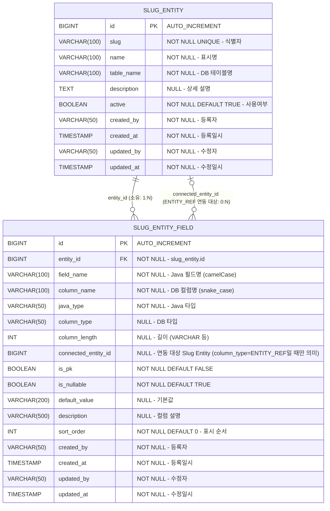

# Slug Entity DB 설계서

## 1. ERD



> ⚠️ `SLUG_ENTITY_FIELD`는 `SLUG_ENTITY`를 두 방향으로 참조한다.
> - `entity_id` — **이 필드가 소속된 Entity**(소유 관계, NOT NULL, ON DELETE CASCADE).
> - `connected_entity_id` — **이 필드가 연동 대상으로 가리키는 다른 Entity**(메타 참조, NULL 허용, `column_type=ENTITY_REF`일 때만 의미). 소유가 아니라 "이 필드 값이 어느 Entity의 레코드 id 배열을 담는지"를 정의한다.

## 2. 테이블 상세

### 2.1 slug_entity

| 컬럼 | 타입 | NULL | 기본값 | 설명 |
|:---|:---|:---|:---|:---|
| `id` | BIGINT | NO | AUTO_INCREMENT | PK |
| `slug` | VARCHAR(100) | NO | - | 식별자 (시스템 내 유일, 예: member) |
| `name` | VARCHAR(100) | NO | - | 표시명 (예: 회원) |
| `table_name` | VARCHAR(100) | NO | - | 매핑되는 DB 테이블명 (예: tb_member) |
| `description` | TEXT | YES | NULL | 상세 설명 |
| `active` | BOOLEAN | NO | TRUE | 사용여부 |
| `created_by` | VARCHAR(50) | NO | - | 등록자 ID |
| `created_at` | TIMESTAMP | NO | CURRENT_TIMESTAMP | 등록일시 |
| `updated_by` | VARCHAR(50) | NO | - | 수정자 ID |
| `updated_at` | TIMESTAMP | NO | CURRENT_TIMESTAMP | 수정일시 |

**인덱스:**
| 인덱스명 | 컬럼 | 타입 | 설명 |
|:---|:---|:---|:---|
| PK_SLUG_ENTITY | `id` | PRIMARY | PK |
| UQ_SLUG_ENTITY_SLUG | `slug` | UNIQUE | slug 중복 방지 |

---

### 2.2 slug_entity_field

| 컬럼 | 타입 | NULL | 기본값 | 설명 |
|:---|:---|:---|:---|:---|
| `id` | BIGINT | NO | AUTO_INCREMENT | PK |
| `entity_id` | BIGINT | NO | - | FK → slug_entity.id |
| `field_name` | VARCHAR(100) | NO | - | Java 필드명 (camelCase, 예: memberName) |
| `column_name` | VARCHAR(100) | NO | - | DB 컬럼명 (snake_case, 예: member_name) |
| `java_type` | VARCHAR(50) | NO | - | Java 타입 (String / Long / Integer / Boolean / LocalDateTime / BigDecimal) |
| `column_type` | VARCHAR(50) | YES | NULL | DB 타입 (VARCHAR / BIGINT / INT / BOOLEAN / TIMESTAMP / NUMERIC / FILE / ENTITY_REF) |
| `column_length` | INT | YES | NULL | 길이 (VARCHAR 등 길이 있는 타입에만 사용) |
| `connected_entity_id` | BIGINT | YES | NULL | 연동 대상 Slug Entity — `slug_entity.id` 참조. `column_type=ENTITY_REF`일 때만 의미 있음. "이 필드가 어느 Entity의 레코드 id 배열을 담는지" 지정 |
| `is_pk` | BOOLEAN | NO | FALSE | PK 여부 |
| `is_nullable` | BOOLEAN | NO | TRUE | NULL 허용 여부 |
| `default_value` | VARCHAR(200) | YES | NULL | 기본값 |
| `description` | VARCHAR(500) | YES | NULL | 컬럼 설명 |
| `sort_order` | INT | NO | 0 | 필드 표시 순서 |
| `created_by` | VARCHAR(50) | NO | - | 등록자 ID |
| `created_at` | TIMESTAMP | NO | CURRENT_TIMESTAMP | 등록일시 |
| `updated_by` | VARCHAR(50) | NO | - | 수정자 ID |
| `updated_at` | TIMESTAMP | NO | CURRENT_TIMESTAMP | 수정일시 |

**인덱스:**
| 인덱스명 | 컬럼 | 타입 | 설명 |
|:---|:---|:---|:---|
| PK_SLUG_ENTITY_FIELD | `id` | PRIMARY | PK |
| IDX_SLUG_ENTITY_FIELD_ENTITY | `entity_id` | INDEX | entity 기준 필드 목록 조회 |
| IDX_SLUG_ENTITY_FIELD_CONNECTED | `connected_entity_id` | INDEX | 특정 Entity를 연동 대상으로 삼는 필드 역조회 |

---

### 2.3 java_type 허용값

| java_type | column_type 예시 | 설명 |
|:---|:---|:---|
| `String` | VARCHAR | 문자열 |
| `Long` | BIGINT | 64비트 정수 |
| `Integer` | INT | 32비트 정수 |
| `Boolean` | BOOLEAN | 불리언 |
| `LocalDateTime` | TIMESTAMP | 날짜+시간 |
| `LocalDate` | DATE | 날짜 |
| `BigDecimal` | NUMERIC | 금액/소수 |
| `List<Long>` | BIGINT[] | 배열 참조 — `FILE`(파일 메타 id 목록), `ENTITY_REF`(연동 Entity 레코드 id 목록) |

### 2.4 column_type → Java 타입 매핑 (`SlugColumnTypeMapping`)

`slug_entity_field.column_type` 값은 코드 생성 시 `SlugColumnTypeMapping`(`bo-api/.../service/SlugColumnTypeMapping.java`) enum에 의해 결정론적으로 Java 타입/DDL 타입으로 변환된다. 매핑표에 없는 값이 들어오면 코드 생성이 즉시 차단된다(fail-fast).

| column_type | Java 타입 | DDL 타입 | 비고 |
|:---|:---|:---|:---|
| `VARCHAR` | String | VARCHAR | 길이 지정 |
| `TEXT` | String | TEXT | - |
| `BIGINT` | Long | BIGINT | - |
| `INT` | Integer | INTEGER | - |
| `BOOLEAN` | Boolean | BOOLEAN | - |
| `DATE` | LocalDate | DATE | - |
| `TIMESTAMPTZ` | OffsetDateTime | TIMESTAMPTZ | - |
| `JSONB` | String | JSONB | `@Type(JsonStringType.class)` |
| `FILE` | `List<Long>` | BIGINT[] | `file_meta.id` 목록 (배열, `@JdbcTypeCode(SqlTypes.ARRAY)`) |
| `ENTITY_REF` | `List<Long>` | BIGINT[] | **신규** — 연동 대상 Entity 레코드 id 목록 (배열). `FILE`과 동일한 배열 매핑 방식 재사용 |

> ⚠️ **`ENTITY_REF`는 생성되는 업무 테이블 컬럼에서 `List<Long>`/`BIGINT[]`(배열)로 매핑된다.** 값은 연동 대상 Entity(=해당 필드의 `connected_entity_id`가 가리키는 Slug Entity)의 실제 레코드 id들이다.
> - Form 위젯이 다중 선택 값을 항상 배열로 싣는 계약에 맞춰 단일 `Long`이 아니라 배열로 생성한다(`FILE` 타입과 동일한 이유 — 04번 가이드 §0-4 참고).
> - 실제 FK/`@ManyToOne` 연관관계는 만들지 않는다 — 배열 컬럼(`bigint[]`)은 참조무결성을 보장하지 않으며, 이는 04번 가이드 §0-3(마스터 Entity 자동 필드)과 동일한 방침이다.
> - `connected_entity_id`(메타: 어느 Entity를 가리키는지)와 실제 배열 값(각 레코드 id)은 서로 다른 레벨이다 — 전자는 정의, 후자는 데이터다.

## 3. DDL

```sql
-- slug_entity 테이블
CREATE TABLE slug_entity (
    id          BIGINT GENERATED ALWAYS AS IDENTITY PRIMARY KEY,
    slug        VARCHAR(100) NOT NULL,
    name        VARCHAR(100) NOT NULL,
    table_name  VARCHAR(100) NOT NULL,
    description TEXT,
    active      BOOLEAN      NOT NULL DEFAULT TRUE,
    created_by  VARCHAR(50)  NOT NULL,
    created_at  TIMESTAMPTZ  NOT NULL DEFAULT NOW(),
    updated_by  VARCHAR(50)  NOT NULL,
    updated_at  TIMESTAMPTZ  NOT NULL DEFAULT NOW(),

    CONSTRAINT uq_slug_entity_slug UNIQUE (slug)
);

-- slug_entity_field 테이블
CREATE TABLE slug_entity_field (
    id             BIGINT GENERATED ALWAYS AS IDENTITY PRIMARY KEY,
    entity_id      BIGINT       NOT NULL REFERENCES slug_entity(id) ON DELETE CASCADE,
    field_name     VARCHAR(100) NOT NULL,
    column_name    VARCHAR(100) NOT NULL,
    java_type           VARCHAR(50)  NOT NULL,
    column_type         VARCHAR(50),
    column_length       INT,
    connected_entity_id BIGINT       REFERENCES slug_entity(id) ON DELETE SET NULL,
    is_pk               BOOLEAN      NOT NULL DEFAULT FALSE,
    is_nullable         BOOLEAN      NOT NULL DEFAULT TRUE,
    default_value       VARCHAR(200),
    description         VARCHAR(500),
    sort_order          INT          NOT NULL DEFAULT 0,
    created_by          VARCHAR(50)  NOT NULL,
    created_at          TIMESTAMPTZ  NOT NULL DEFAULT NOW(),
    updated_by          VARCHAR(50)  NOT NULL,
    updated_at          TIMESTAMPTZ  NOT NULL DEFAULT NOW()
);

CREATE INDEX idx_slug_entity_field_entity ON slug_entity_field(entity_id);
CREATE INDEX idx_slug_entity_field_connected ON slug_entity_field(connected_entity_id);
```

## 4. 설계 결정 사항

- **slug UNIQUE 제약**: slug_registry와 동일하게 DB 레벨 UNIQUE 인덱스 적용. slug는 등록 후 수정 불가.
- **ON DELETE CASCADE**: slug_entity 삭제 시 하위 slug_entity_field 전체 자동 삭제.
- **java_type 고정 목록**: String / Long / Integer / Boolean / LocalDateTime / LocalDate / BigDecimal 7가지로 제한. 변동 가능성 낮아 Enum 고정 관리.
- **sort_order**: 필드 표시 순서를 명시적으로 관리. 프론트에서 드래그 정렬 지원 시 사용.
- **감사 컬럼 4개 필수**: created_by / created_at / updated_by / updated_at (JPA Auditing 적용).
- **PostgreSQL 방언 적용**: IDENTITY, TIMESTAMPTZ, NOW() — 기존 프로젝트 DB 표준과 동일.

### 4.1 `ENTITY_REF` 타입 / `connected_entity_id` 컬럼 (신규)

- **`ENTITY_REF` 타입 추가**: `SlugColumnTypeMapping` enum에 `ENTITY_REF`를 추가한다. 생성 Entity 컬럼에서는 `List<Long>`/`BIGINT[]`(배열)로 매핑되며, 값은 연동 대상 Entity의 레코드 id 배열이다. `FILE` 타입과 동일한 배열 매핑 방식(`@JdbcTypeCode(SqlTypes.ARRAY)`, `columnDefinition="bigint[]"`)을 그대로 재사용한다.
- **`connected_entity_id` 컬럼 추가**: `slug_entity_field`에 신규 메타 컬럼으로 추가한다. `column_type=ENTITY_REF`인 필드가 "어느 Slug Entity를 연동 대상으로 삼는지"를 가리킨다(단일 참조). 다른 타입 필드에서는 NULL이다.
- **`connected_entity_id` FK 판단 → 실제 FK 부여(ON DELETE SET NULL)**:
  - `slug_entity_field`는 이미 `entity_id`로 `slug_entity(id)`에 실제 FK를 걸고 있고(소유 관계, ON DELETE CASCADE), `slug_entity.parent_entity_id`(§0-3 마스터 Entity)도 자기참조 실제 FK를 걸고 있는 선례가 있다. 두 컬럼 모두 **메타데이터 테이블끼리의 참조**이므로 `connected_entity_id`에도 실제 FK를 거는 것이 일관성 있고 참조무결성 확보에 유리하다.
  - 단, **삭제 정책은 `entity_id`의 CASCADE와 다르게 `ON DELETE SET NULL`로 한다.** `connected_entity_id`는 소유가 아니라 "가리킴" 관계이므로, 연동 대상 Entity가 삭제되면 필드 자체를 지우는 게 아니라(그 필드는 다른 Entity 소속) 연동 지정만 NULL로 해제되어야 한다.
  - ⚠️ 이 FK는 **메타 테이블 간 정합성**만 보장한다. 실제 생성되는 업무 테이블의 `ENTITY_REF` 배열 컬럼(`bigint[]`) 값에는 FK가 없어 대상 레코드의 참조무결성은 보장되지 않는다(§0-3, §0-4 배열 매핑과 동일 방침).

### 4.2 `connected_entity_id` vs `parent_entity_id`(§0-3 마스터 Entity) — 별개 개념

이름과 대상 테이블이 비슷해 혼동하기 쉽지만 레벨과 카디널리티가 완전히 다르다.

| 구분 | `slug_entity.parent_entity_id` (§0-3 마스터 Entity) | `slug_entity_field.connected_entity_id` (신규) |
|:---|:---|:---|
| 소속 테이블 | `slug_entity` (Entity 전체) | `slug_entity_field` (개별 필드) |
| 레벨 | Entity 단위 | 필드 단위 |
| 의미 | 이 Entity의 **마스터(부모) Entity** | 이 필드가 **연동 대상으로 가리키는 Entity** |
| 참조 대상 | `slug_entity.id` (자기참조) | `slug_entity.id` (다른 Entity) |
| 카디널리티 | 1 (부모 하나) | 1 (대상 Entity 하나 지정) — 단, 그 필드의 **저장 값**은 대상 레코드 id 배열(다중) |
| 트리거되는 자동 동작 | 자식 Entity 필드 목록에 `{마스터slug}_id`(BIGINT, 단일) 자동 추가 | 필드 값이 `List<Long>`/`BIGINT[]`(배열)로 코드 생성 |
| FK 여부 | 실제 자기참조 FK (자식 있으면 부모 삭제 409) | 실제 FK, ON DELETE SET NULL |
