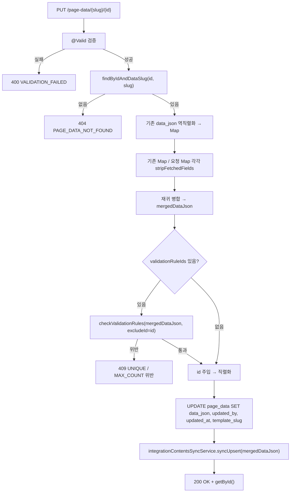

# 운영페이지 데이터 수정 병합저장 BE 상세 설계서

## 1. 개요

- **도메인**: 페이지 메이커 운영페이지 데이터 수정 저장 (`page_data.data_json`)
- **DB 설계**: [db_page-data-merge-update.md](../../db/page-data-merge-update/db_page-data-merge-update.md)
- **기준 문서**: [be_page-data.md](../page-data/be_page-data.md) (엔드포인트 전체 명세)
- **대상 메서드**: `PageDataService.update(String slug, Long id, PageDataRequest request, Long siteId)`
- **변경 성격**: **엔드포인트 시그니처 변경 없음** — URL / HTTP Method / 요청·응답 DTO / 파라미터 모두 그대로이며,
  `data_json`을 계산하는 **내부 로직만** 교체(전량 대체 → 병합)한다.

**적용 범위**: `page_data`(JSONB) 기반 Slug 타입 페이지에 한정.
Data Entity 연동(`connectedType='entity'/'data'`) 저장 경로는 별도 테이블·별도 서비스를 타므로 이번 스코프가 아니다.

---

## 2. 엔드포인트 (변경 없음)

| Method | URL | 설명 | 권한 | 성공 코드 |
|:---|:---|:---|:---|:---|
| PUT | `/api/v1/page-data/{slug}/{id}` | 데이터 수정 | 인증된 관리자 | 200 |

**요청 헤더 / 바디** — 기존과 동일.

| 항목 | 타입 | 필수 | 설명 |
|:---|:---|:---|:---|
| `X-Site-Id` (Header) | Long | N | 사이트 스코프 |
| `dataJson` | Map\<String, Object\> | Y | 이번 저장 화면에 존재하는 필드의 키:값 쌍 |
| `templateSlug` | String | N | 미전달 시 경로변수 `slug` 사용 |
| `validationRuleIds` | List\<Long\> | N | 적용할 검증 규칙 ID 목록 |

**응답** — `PageDataResponse` (200). 응답의 `dataJson`은 병합 후 DB에 반영된 최종 값이다.

---

## 3. 동작 정의

### 3.1 현재 동작 (변경 전)

`update()`는 요청 `dataJson`에서 `_fetchedRel*` 키만 제거(`stripFetchedFields`)하고 `id`를 덧붙인 뒤,
그 결과를 `data_json` 컬럼에 **통째로 덮어쓴다.** 기존 행의 `data_json`은 조회만 하고(존재 확인/`siteId` 획득)
값 계산에는 사용하지 않는다.

```
요청 dataJson → stripFetchedFields → id 주입 → UPDATE page_data SET data_json = (그 값)
```

결과적으로 요청에 담기지 않은 키는 저장 시점에 사라진다.

### 3.2 변경 후 동작

기존 행의 `data_json`을 읽어 요청 값과 **재귀 병합**한 결과를 저장한다.

**병합 규칙 (키 단위, 재귀):**

| 조건 | 처리 |
|:---|:---|
| 요청에 키가 있고, 기존·요청 양쪽 값이 모두 `Map` | 한 단계 더 들어가 **재귀 병합** |
| 요청에 키가 있음 (그 외 모든 경우 — 스칼라 / `List` / `null` / 타입 불일치) | 요청 값으로 **교체** |
| 요청에 키가 없음 | 기존 값 **보존** |

- 빈 문자열(`""`)도 "키가 있는" 케이스다 → 그대로 덮어쓴다(값 비우기는 정상 저장이며 보존 대상이 아니다).
- `List`(SubList `rows`, MultiSelect id 배열, 파일 ID 배열)는 요소 단위로 합치지 않고 통째 교체한다.
- 병합 기준값(기존 `data_json`)에도 `stripFetchedFields`를 적용해, 조회 시 덧붙는 `_fetchedRel*` 파생 키가
  다시 저장되지 않도록 한다 — `patchField()`가 이미 쓰고 있는 처리와 동일하다.
- 병합 완료 후 `id` 키를 행의 `id`로 주입하는 것은 기존과 동일.

### 3.3 처리 순서



**핵심 순서 변경**: 현재는 `checkValidationRules`가 조회 직후, 병합 개념 없이 **요청 `dataJson` 기준**으로
호출된다. 변경 후에는 **병합 이후로 이동**하여 `mergedDataJson` 기준으로 판정한다.
검증은 "실제로 DB에 남게 될 값"을 대상으로 해야 하기 때문이다.

**예시 — unique 규칙 필드가 `hideCondition`으로 숨겨진 채 저장되는 경우**

| | 요청 dataJson | 검증 대상 값 | 결과 |
|:---|:---|:---|:---|
| 현재 | `code` 키 없음 | `""` (요청에서 못 찾음) | 실제 저장될 값(`A-001`)이 아닌 빈값으로 검사 — 판정 무의미 |
| 변경 후 | `code` 키 없음 | `A-001` (기존 보존값) | 최종 저장값 기준으로 중복 판정 |

> `checkUniqueRule` / `checkMaxCountRule`는 이미 `excludeId`(자기 자신 제외)를 받고 있으므로,
> 자기 행이 중복으로 걸리는 문제는 발생하지 않는다. 넘기는 `dataJson` 인자만 병합 결과로 바꾸면 된다.
> `checkPkDuplicate`는 `create()`에서만 호출되며 `update()` 경로에는 없다 — 이번 변경 대상 아님.

---

## 4. 구현 지침

### 4.1 재사용할 기존 패턴 — `patchField()`

`PageDataService.patchField()`가 이미 동일한 read-modify-write 구조를 갖고 있다.
아래 조각을 그대로 따르고, "단일 키 갱신" 부분만 "재귀 병합"으로 바꾼다.

- 기존 `data_json` 문자열 → `objectMapper.readValue(..., TypeReference<Map<String,Object>>)`로 역직렬화
- 파싱 실패 시 빈 `LinkedHashMap`으로 대체 (요청 값만으로 저장 — 기존 동작과 동일해짐)
- `LinkedHashMap` 사용으로 키 순서 유지
- `stripFetchedFields` 적용 후 가공
- `id` 주입 → `serializeDataJson` → 네이티브 `UPDATE`

### 4.2 병합 유틸

`PageDataService` 내부 private 메서드로 둔다(다른 서비스에서 필요해지면 그때 승격).

| 항목 | 내용 |
|:---|:---|
| 시그니처 | `private Map<String,Object> deepMerge(Map<String,Object> base, Map<String,Object> patch)` |
| 반환 | 새 `LinkedHashMap` (인자 Map을 변형하지 않음) |
| 키 순서 | `base` 키 순서 유지, `patch`에만 있는 키는 뒤에 추가 |
| 중첩 판정 | `base` 값과 `patch` 값이 **둘 다** `Map`일 때만 재귀, 그 외는 `patch` 값 채택 |
| `null` | `patch`에 키가 존재하면 값이 `null`이어도 채택(교체) |

### 4.3 함께 조정할 호출부 — `IntegrationContentsSyncService`

`update()` 말미의 `integrationContentsSyncService.syncUpsert(slug, id, cleanDataJson, existing.getSiteId())`는
현재 **요청 기준 값**을 넘긴다. 이 서비스는 넘겨받은 `dataJson`에서 중첩 섹션의 `title` / `content`를 읽고,
없으면 `INTEGRATION_CONTENTS_FIELD_MISSING` 예외를 던진다.

병합 도입 후 요청에 해당 섹션이 없을 수 있으므로, **`mergedDataJson`을 넘기도록 바꾼다.**
그래야 (1) 보존된 기존 `title`/`content`로 연동 데이터가 유지되고, (2) 요청에 섹션이 없다는 이유만으로
저장이 실패하지 않는다. `is_visible` / `image` 역시 같은 이유로 병합 후 값을 보아야 한다.

> 점검 기준: `update()` 안에서 `request.getDataJson()` 파생값을 읽는 지점이 남아 있으면 안 된다.
> 병합 이후의 모든 소비처는 `mergedDataJson`을 본다.

### 4.4 영향 범위

| 대상 | 영향 |
|:---|:---|
| `create()` | 영향 없음 — 신규 등록에는 병합할 기존 값이 없다 |
| `patchField()` | 영향 없음 — 이미 read-modify-write |
| `delete()` / `deleteByPk()` | 영향 없음 |
| 목록/단건 조회 | 영향 없음 |
| BO 정렬 저장(`CategoryRenderer`의 `PUT /page-data/{slug}/{id}`) | 기존 `_dataJson` 전체 + `sortOrder`를 보내므로 병합 결과가 기존과 동일 |

---

## 5. 예외 매핑 (변경 없음)

| 예외 상황 | HTTP | Error Code |
|:---|:---|:---|
| 데이터 없음 / slug 불일치 | 404 | PAGE_DATA_NOT_FOUND |
| `dataJson` 빈 값 | 400 | VALIDATION_FAILED |
| unique 규칙 위반 | 409 | VALIDATION_RULE_UNIQUE_VIOLATION |
| maxCount 규칙 초과 | 409 | VALIDATION_RULE_MAX_COUNT_EXCEEDED |
| 연동 대상 slug인데 title/content 없음 | 400 | INTEGRATION_CONTENTS_FIELD_MISSING |

> 신규 ErrorCode 추가 없음.

---

## 6. BE 개발 체크리스트

> ⚠️ 모든 항목이 ✅가 될 때까지 완료 보고 불가

### 6.1 병합 로직

- [ ] `update()`가 기존 행의 `data_json`을 역직렬화해 병합 기준값으로 사용하는가?
- [ ] 요청에 있는 키가 빈 문자열(`""`)이면 그 값으로 덮어쓰는가? (보존되면 안 됨)
- [ ] 요청에 없는 최상위 키가 보존되는가?
- [ ] 중첩 섹션(`contentKey` 하위)에서 요청에 없는 **내부 키만** 보존되고 나머지는 요청 값으로 갱신되는가?
- [ ] `_rel` 하위도 동일하게 재귀 병합되는가?
- [ ] `List`(SubList `rows`, MultiSelect 배열, 파일 ID 배열)가 요소 단위 병합 없이 통째 교체되는가?
- [ ] 기존·요청 값의 타입이 다를 때(예: 기존 Map, 요청 String) 요청 값으로 교체되는가?
- [ ] 병합 기준값에도 `stripFetchedFields`가 적용되어 `_fetchedRel*` 키가 저장되지 않는가?
- [ ] `deepMerge`가 인자 Map을 변형하지 않고 새 Map을 반환하는가?
- [ ] 기존 `data_json` 파싱 실패 시에도 예외 없이 요청 값 기준으로 저장되는가?

### 6.2 검증 규칙

- [ ] `checkValidationRules` 호출이 병합 **이후**로 이동했는가?
- [ ] 넘기는 인자가 `mergedDataJson`인가? (`request.getDataJson()`이 남아 있지 않은가)
- [ ] `excludeId = id`가 그대로 유지되어 자기 행이 중복 판정되지 않는가?
- [ ] unique 대상 필드가 화면에서 숨겨진 상태로 저장해도 기존 보존값 기준으로 판정되는가?

### 6.3 연동/부수효과

- [ ] `syncUpsert`에 `mergedDataJson`을 넘기는가?
- [ ] 연동 대상 slug에서 title/content가 담긴 섹션을 요청에 포함하지 않고 저장해도 500/400 없이 성공하는가?
- [ ] `updated_by` / `updated_at` / `template_slug` 갱신 동작이 기존과 동일한가?
- [ ] `id` 키가 병합 후에도 행의 `id`로 주입되는가?

### 6.4 회귀

- [ ] 모든 필드를 보낸 일반 수정 저장의 결과가 변경 전과 동일한가?
- [ ] `create()` / `patchField()` / `delete()` 동작에 변화가 없는가?
- [ ] `CategoryRenderer` 정렬 저장(PUT) 결과가 변경 전과 동일한가?
- [ ] `./gradlew build` 오류가 없는가?
